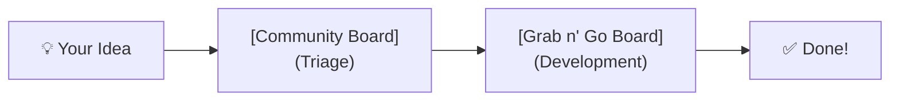
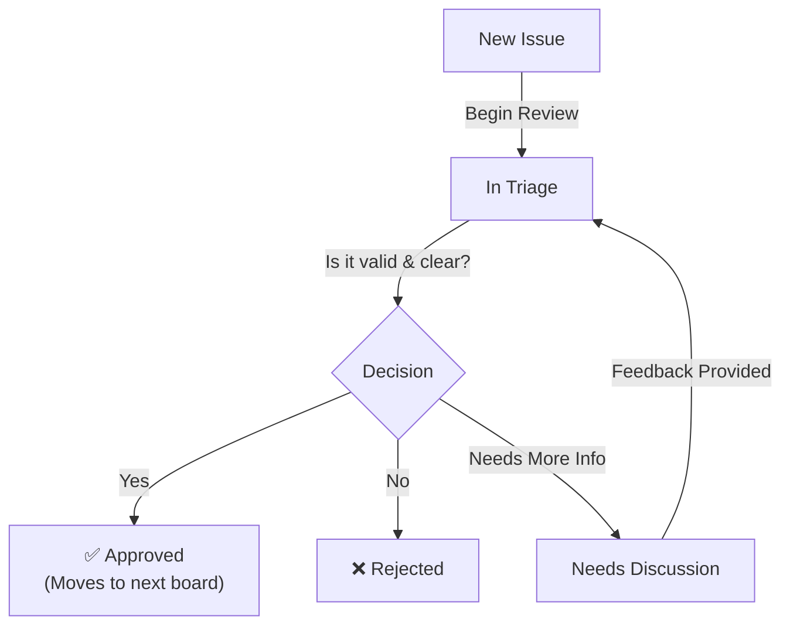
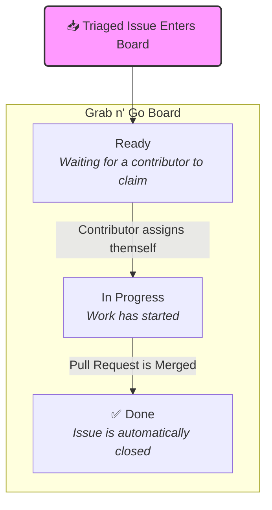

Community Hub은 커뮤니티 주도 기여를 수집하고 관리하는 협업 플랫폼입니다. 새로운 콘텐츠 제안, 기능 요청, 이슈 보고, dApp 아이디어 구상 등 무엇이든 이 저장소에서 시작하세요. GitHub의 이슈, 프로젝트, 자동화 기능을 활용하여 아이디어를 효율적으로 분류하고 실행 가능한 작업으로 전환합니다.

## How to Contribute

참여 방법은 간단합니다. [**이슈를 생성**](https://github.com/midnightntwrk/community-hub/issues/new/choose)하세요.

## Our Workflow: From Idea to Reality

## Step 1: The Community Board (Triage)

모든 새 이슈는 초기 검토를 위해 여기에 등록됩니다. 이 보드는 공개되어 있으므로 누구나 무엇이 제안되고 있는지 볼 수 있습니다.

- `New`: 이슈가 제출되어 검토를 기다리고 있습니다.
- `In Triage`: 분류 위원회가 제출물의 유효성, 명확성, 우선순위를 검토 중입니다.
- `Needs Discussion`: 커뮤니티 또는 작성자의 추가 피드백이나 설명이 필요한 상태입니다.
- `Rejected`: 범위를 벗어나거나 유효하지 않은 이슈입니다. 거부 사유는 항상 명확히 안내합니다.

이슈가 승인되면 triaged 라벨이 부여되고 자동으로 다음 단계로 이동합니다.

## Step 2: The Grab n' Go Board (Development)

이 보드에는 승인되어 작업 준비가 된 태스크가 포함되어 있습니다. 커뮤니티의 백로그입니다!

- `Ready`: 기여자가 가져가기를 기다리는 분류된 이슈입니다. 처음이라면 good-first-issue 라벨을 찾아보세요!
- `In Progress`: 기여자가 이슈를 자신에게 할당하고 적극적으로 작업 중입니다.
- `Done`: 작업이 완료되고 이슈가 닫혔습니다(연결된 PR이 머지되면 자동으로 발생합니다).

## Choosing the Right Issue Template

빠른 분류와 검토를 위해, 제출 내용에 맞는 템플릿을 선택하세요:

- `Content Proposal`: 새로운 기사, 튜토리얼, 교육 리소스를 제안합니다.
- `Feature Request/Suggestion`: 도구와 프로세스의 새 기능이나 개선 사항을 제안합니다.
- `Bug Report`: 결함, 오류, 예상과 다른 동작을 보고합니다. 재현 단계를 명확히 포함하세요!
- `dApp Proposal`: 새로운 탈중앙화 애플리케이션, 통합, 개선 아이디어를 공유합니다.

템플릿을 선택하면 적절한 라벨이 자동으로 적용되어 자동화가 체계적으로 관리됩니다.

궁극적으로 커뮤니티의 집단 지혜를 모아 더 견고한 솔루션을 함께 만들어가는 협업 환경을 지향합니다.

## Why Now? The Developer Relations Perspective

"왜 Developer Relations(DevRel) 팀이 이걸 시작하나요?"라고 궁금하실 수 있습니다. 좋은 질문이고, 저희 미션의 핵심과 직결됩니다!

Developer Relations의 본질은 개발자 역량 강화입니다.

Community Board는 이 미션을 자연스럽게 확장한 것입니다. 중요한 이유는 다음과 같습니다:

1. Direct Feedback Loop: 기존에는 피드백이 여러 채널에 흩어져 있었습니다. Community Board가 이를 한곳에 모아, 여러분에게 가장 중요한 것이 무엇인지 명확하게 보여줍니다.
2. Transparency and Prioritization: 다른 개발자가 무엇을 요청하는지 확인하고, 좋은 아이디어에 투표하고, 이슈가 "검토 중"에서 "계획됨", "출시됨"으로 진행되는 과정을 지켜볼 수 있습니다. 이런 투명성 덕분에 로드맵과 여러분의 기여가 어떻게 맞물리는지 파악할 수 있습니다.
3. Community-Driven Development: 최고의 제품은 사용자와의 협업에서 나온다고 확신합니다. 보드를 통해 커뮤니티의 집단 지성을 활용하여 가장 영향력 있는 아이디어를 발굴하고, 실제 수요로 검증할 수 있습니다.
4. Building Stronger Relationships: 명확하고 실행 가능한 기여 방법을 제공하여, 모든 참여자가 함께 성장하고 있다고 느낄 수 있는 활발한 커뮤니티를 만들고자 합니다.