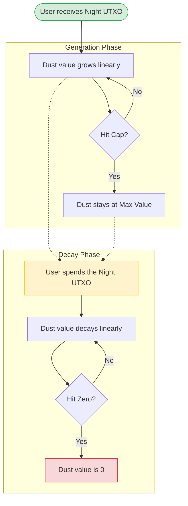
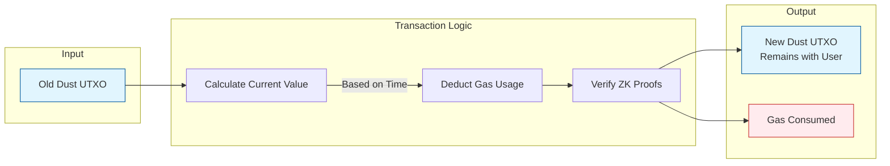
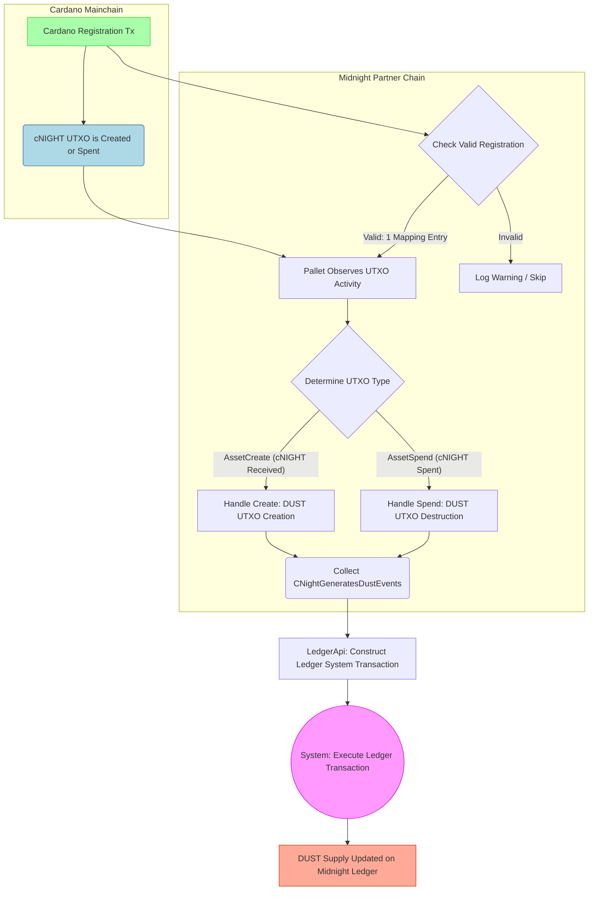

# Architecture Overview DUST and Network Usage

이 시스템을 이해하려면 비유를 활용하는 것이 좋습니다.

- **Night**은 **태양광 패널**과 같습니다. 보유하고 있는 가치 있는 자산입니다.
- **Dust**는 **전기**와 같습니다. 태양광 패널(Night)이 생성하는 컴퓨팅 처리량 또는 가스를 나타냅니다.
- **Usage**. 네트워크에서 작업을 수행하기 위해 전기(DUST)를 가스로 소비합니다.

"코인 5개를 보유하고 있다"처럼 정적 잔액을 가진 일반 암호화폐와 달리, Dust 잔액은 시간과 Night 토큰 상태에 따라 동적으로 변합니다.

## Dust and network usage

Dust는 [Zswap](https://github.com/midnightntwrk/midnight-ledger/blob/main/spec/zswap.md)과 유사하지만 별도로 운영됩니다. Dust는 Midnight의 리소스 크레딧 시스템으로 기능합니다.

  - **차폐 및 양도 불가:** Dust는 가스 *전용*의 차폐된 용량 리소스입니다. 사용자 간 전송이 불가능합니다.
  - **동적 용량:** Dust UTXO의 사용 가능한 가스는 연관된 Night UTXO에서 동적으로 계산됩니다.
  - **생성과 소멸:** 계산된 값은 Night UTXO에 기반한 최대값까지 시간에 따라 증가하고, Night UTXO가 소비된 후에는 0으로 감소합니다.
  - **비영속적:** 시스템이 하드포크 시 재분배할 수 있습니다. (참고: Midnight 프로토콜은 가비지 컬렉션 등을 위해 Dust 할당 규칙을 수정할 권리를 보유합니다).

## Design overview

Zswap과 마찬가지로, Dust는 해시와 커밋먼트/무효화자 패러다임 위에 구축됩니다. 각 Dust UTXO는 생성 시 추가 전용 머클 트리에 삽입되는 **커밋먼트**와 소비 시 무효화자 집합에 삽입되는 **무효화자**를 가집니다.

Dust "소비"는 1대1 "전송"(자기 전송)입니다:

1.  **입력:** 1개의 Dust UTXO (무효화자).
2.  **출력:** 1개의 Dust UTXO (커밋먼트).
3.  **수수료:** 지불된 수수료의 공개 선언.

여기에는 다음을 증명하는 영지식 증명이 포함됩니다:

1.  입력이 유효하며 머클 트리에 존재합니다.
2.  출력 값은 *업데이트된* 입력 값에서 소비된 가스를 뺀 것과 같습니다.
3.  출력 무효화자가 올바르며, 소유자는 동일합니다.

### Lifecycle: NIGHT generates DUST

개념적으로 Dust는 보유 중인 *Night* UTXO에 의해 시간이 지남에 따라 생성됩니다. 뒷받침하는 Night UTXO가 소비되지 않는 한, 연관된 Dust UTXO는 상한($\rho$)까지 가치를 생성합니다. 뒷받침하는 Night이 소비되면, Dust UTXO는 0으로 "소멸"됩니다.

다음 다이어그램은 이 수명 주기를 보여줍니다:



생성 속도는 보유한 Night 양($N$), Dust 상한 대 Night 보유량 비율($\rho$), "상한까지의 시간"($\Delta$)에 따라 달라집니다.

**Spending Rules:**

  * Dust는 여러 번 소비될 수 있으며, 값이 0이더라도 항상 새 UTXO가 생성됩니다.
  * 소멸 중 소비가 허용되며 소멸 속도에 영향을 주지 않습니다.
  * 뒷받침하는 Night이 소비되면, 아직 생성 단계에 있더라도 Dust는 즉시 소멸을 시작합니다.
  * 뒷받침하는 Night의 일부만 소비되면, 거스름돈이 새로운 Night UTXO를 생성하고(새로운 Dust 생성 시작), 기존 Dust UTXO는 소멸됩니다.


**Implementation Note:**
실제로는 값이 연속적으로 처리되지 않습니다. 소비 시점에 메타데이터("생성 정보")를 사용하여 **계산**됩니다:

1.  Dust UTXO의 생성 시간.
2.  뒷받침하는 Night UTXO의 생성 시간.
3.  뒷받침하는 Night UTXO의 삭제 시간.

Dust와 Night은 서로 다른 키를 사용하므로, **등록 테이블**이 Night 공개 키를 Dust 공개 키에 연결합니다. Night UTXO가 생성되고 *또한* 해당 키에 테이블 항목이 있는 경우에만 새 Dust UTXO가 생성됩니다.

**The Grace Period:**
Dust 사용은 차폐되어 있으므로, 값은 *트랜잭션 생성* 시점으로 계산됩니다. 네트워크 지연을 고려하기 위해 프로토콜은 **Dust Grace Period**(예: 3시간)를 정의합니다. 트랜잭션의 타임스탬프가 블록 시간을 기준으로 이 범위 내에 있으면 수락됩니다.

## Preliminaries

DUST는 ZK 친화적 해시를 사용합니다.

```rust
type DustSecretKey = Fr;
type DustPublicKey = field::Hash<DustSecretKey>;
```

Dust UTXO에는 소유자, 값, **논스**가 있습니다. 논스는 지갑 복구를 위해 결정적으로 발전합니다.

  * **첫 번째 Dust UTXO:** 논스는 원래 Night UTXO 인텐트 해시에서 파생됩니다.
  * **후속 Dust UTXO:** 논스는 이전 시퀀스 번호와 소유자의 비밀 키에서 파생됩니다.

```rust
struct DustOutput {
    initial_value: u128,   // Specks at creation
    owner: DustPublicKey,
    nonce: field::Hash<(InitialNonce, u32, Fr)>,
    seq: u32,
    ctime: Timestamp,
}
```

상태 구성 요소에는 커밋먼트 트리, 무효화자 집합, 루트 히스토리가 포함됩니다:

```rust
struct DustUtxoState {
    commitments: MerkleTree<DustCommitment>,
    commitments_first_free: usize,
    nullifiers: Set<DustNullifier>,
    root_history: TimeFilterMap<MerkleTreeRoot>,
}
```

## Initial DUST parameters

* **Night Unit:** `Star (1 Night = 10^6 Stars)`
* **Dust Unit:** `Speck (1 Dust = 10^15 Specks)`

```rust
const INITIAL_DUST_PARAMETERS: DustParameters = {
    night_dust_ratio = 5_000_000_000; // 5 DUST per NIGHT
    generation_decay_rate = 8_267; // ~1 week generation time
    dust_grace_period = Duration::from_hours(3),
};
```

## Dust actions

사용자는 **인텐트**를 통해 Dust 상태에 영향을 미칩니다.

```rust
struct DustActions<S, P> {
    spends: Vec<DustSpend<P>>,
    registrations: Vec<DustRegistration>,
    ctime: Timestamp,
}
```

### Registrations and fees

`DustRegistration`은 Night 키를 Dust 키에 연결합니다.

  * 등록은 순차적으로 처리됩니다.
  * 등록 트랜잭션이 *이전에 Dust를 생성하지 않던* Night 입력(즉, 기존 등록이 없던 입력)을 사용하는 경우, 시스템은 해당 입력이 *생성했을* Dust로 가스 비용을 지불하도록 등록을 "소급 적용"할 수 있습니다.

## Generating DUST

Night 입력/출력은 **Dust Generation Tree**에 대한 업데이트를 트리거합니다.

  * **DustGenerationInfo:** Night 양, 소유자, `dtime`(삭제 시간)을 저장합니다.
  * **Address Map:** Night 주소 -> Dust 주소를 연결합니다.

```rust
struct DustGenerationInfo {
    value: u128,
    owner: DustPublicKey,
    nonce: InitialNonce,
    dtime: Timestamp, // Set to MAX if Night is unspent
}
```

## Dust value and spends

Dust UTXO의 값은 네 개의 선형 시간 구간을 기반으로 계산됩니다:

1.  **생성:** 생성부터 용량(또는 Night 소비)까지.
2.  **일정(최대):** 용량 도달 후 Night 소비까지.
3.  **소멸:** Night 소비부터 값이 0에 도달할 때까지.
4.  **일정(영):** 그 이후 영구적으로.

### The Spend transaction

`DustSpend`는 UTXO를 소비하고 업데이트된 값에서 수수료를 뺀 새 UTXO를 생성합니다.



검증 로직(`dust_spend_valid`)은 다음을 확인합니다:

  * `commitment_merkle_tree`에 입력이 포함되어 있습니다.
  * `dust_spend.old_nullifier`가 파생된 무효화자와 일치합니다.
  * `updated_value`가 수수료를 충당합니다.
  * `new_commitment`이 올바르게 형성되었습니다.

## Wallet recovery

지갑은 다음 과정으로 자금을 복구합니다:

1.  소유한 Night UTXO를 식별합니다(체인의 시작점).
2.  시퀀스 번호($0, 1, 2...$)에 해당하는 커밋먼트를 선형적으로 탐색합니다.
3.  **프라이버시:** 지갑은 인덱싱 서비스에 대한 프라이버시를 보호하기 위해 정확한 조회 대신 비트 접두사(확률적 필터링)를 사용하여 커밋먼트를 쿼리해야 합니다.


## The implementation

### DUST Generation from Cardano NIGHT Token — Full Process

Cardano **NIGHT** 토큰(cNIGHT)으로부터의 **DUST** 생성은 Midnight 파트너 체인의 **Native Token Observation Pallet**(`pallet_cnight_observation`)이 관리하는 크로스 체인 프로세스입니다.



### Summary of the full flow

1/ 사용자가 Cardano에서 Cardano 보상 주소 + DUST 공개 키를 등록합니다.

2/ 해당 주소에서 cNIGHT UTXO가 생성(수신)되거나 소비(전송)될 때마다 이벤트가 브로드캐스트됩니다.

3-4/ Midnight 팔레트가 정확히 하나의 유효한 등록이 존재하는지 검증하고 cNIGHT 활동을 관찰합니다.

5-6/ 수신(생성)인지 전송(소멸)인지 판별하여 해당하는 DUST 생성 또는 소멸 이벤트를 생성합니다.

7-9/ 블록 내 모든 이벤트가 일괄 처리되어 LedgerApi를 통해 단일 시스템 트랜잭션으로 래핑되고 Midnight 원장에서 실행됩니다.

-> 최종 결과: DUST 공급량과 UTXO가 Cardano의 cNIGHT 이동과 1:1로 업데이트됩니다.

---

**DUST 개요를 살펴보았으니, GitHub의 [DUST 사양](https://github.com/midnightntwrk/midnight-ledger/blob/main/spec/dust.md)도 확인해 보세요!**

**GitHub의 [구현 코드](https://raw.githubusercontent.com/midnightntwrk/midnight-node/refs/heads/main/primitives/mainchain-follower/src/data_source/cnight_observation.rs)도 함께 살펴보세요!**