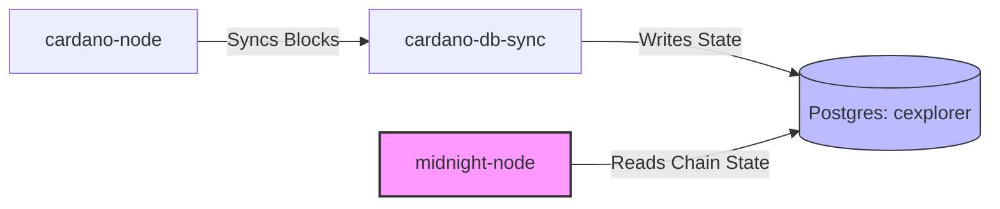
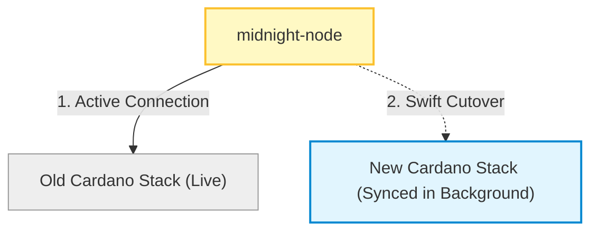

데이터 보호 파트너 체인인 Midnight은 본질적으로 Cardano와 단단히 묶여 있습니다. 이 긴밀한 관계는 견고한 보안과 상호운용성을 제공하지만, Cardano에 큰 변화가 생기면 Midnight도 발맞춰 움직여야 한다는 뜻이기도 합니다.

Cardano 네트워크가 **[Van Rossem 하드포크](https://cardanoupgrades.docs.intersectmbo.org/van-rossem-upgrade/van-rossem-upgrade-overview)**를 준비하면서, Midnight은 인프라 운영의 고전적인 난제와 마주하게 됐습니다. 네트워크의 전원을 내리지 않고 살아 있는 블록체인을 업그레이드하려면 어떻게 해야 할까요?

Cardano 하드포크가 Midnight operator에게 왜 특별한 접근을 요구하는지, 그리고 생태계가 다운타임을 어떻게 줄이는지를 큰 그림에서 살펴봅니다.

## Why Cardano hard forks matter to Midnight

업그레이드 과정을 이해하려면 먼저 아키텍처를 알아야 합니다. Midnight node는 Midnight 소프트웨어만 실행하는 것이 아니라, `cardano-node`, `cardano-db-sync`, Postgres 데이터베이스(`cexplorer`)로 구성된 로컬 Cardano 인프라 스택에 의존합니다.

Midnight node는 이 Postgres 데이터베이스에서 Cardano 메인 체인 상태를 끊임없이 읽으면서 Midnight 블록을 생산하고, 파트너 체인 contract 이벤트를 읽고, NIGHT/DUST 생성 UTXO를 가져옵니다.

Cardano 하드포크가 일어나면:

* **프로토콜이 바뀝니다:** 포크 이전 소프트웨어는 포크 이후 블록을 검증하지 못합니다.
* **연쇄 반응이 일어납니다:** operator의 `cardano-node`가 체인 tip을 따라가지 못하면, `cardano-db-sync`도 Postgres에 데이터를 공급하지 못합니다.
* **결과:** Midnight node가 내려가거나, 곧 블록 생산을 멈추거나, 잘못된 Cardano 체인의 파트너 체인이 되어 버립니다.

따라서 모든 Midnight node operator는 **Van Rossem 하드포크**에 맞춰 Cardano 스택 전체를 업그레이드해야 합니다.

## The Migration Dilemma

블록체인 스택 업그레이드는 "업데이트" 버튼을 누르고 앱을 재시작하는 것처럼 간단하지 않습니다. 큰 업그레이드에는 기반 데이터의 변경이 따라오는 경우가 많습니다. Van Rossem 포크에서 `cardano-node`는 완전히 새로운 **LSM-tree ledger 스토리지 백엔드**로 전환되고(정상 상태 RAM 사용량이 크게 줄어듭니다), `cardano-db-sync`는 완전히 새로운 ledger 스냅샷 포맷과 스키마 마이그레이션을 도입합니다.

mainnet 규모의 데이터로 이 변경을 처리하는 일은 대단히 무겁기 때문에, operator는 성격이 뚜렷이 다른 두 가지 운영 경로 중 하나를 선택하게 됩니다.

### Parallel Cardano Stack (Recommended)

블록을 생산 중인 라이브 시스템을 건드리는 대신, 기존 스택 옆에 완전히 별도의 Cardano 스택을 새로 구축하는 방식입니다.

* **동작 방식:** 새 스택(`cardano-node` 11+, `cardano-db-sync` 13.7.0.5+, Postgres 17)을 백그라운드에서 프로비저닝하고 부트스트랩합니다. 테스트넷 replay는 몇 시간이면 되지만, mainnet ledger replay와 스키마 마이그레이션에는 며칠이 걸립니다. 그동안에도 라이브 Midnight node는 아무 영향 없이 기존 스택 위에서 블록을 계속 생산합니다.
* **전환(cutover):** 새 스택이 라이브 tip까지 완전히 sync되고 안정성이 검증되면, operator는 빠르게 전환을 수행합니다. `midnight-node`가 새 Postgres 인스턴스를 가리키도록 바꾸면 됩니다.

### Typical in-place upgrade

operator가 라이브 `midnight-node`를 내리고, 기존 호스트 하드웨어 위에서 소프트웨어를 직접 업그레이드하는 방식입니다.

데이터베이스 포맷이 바뀌었기 때문에, 디스크를 많이 쓰는 몇 시간짜리 ledger replay와 단일 스레드 스키마 마이그레이션을 순차적으로 처리하는 동안 호스트는 놀고 있어야 합니다.

:::warning[Parallel stack recommended for critical services]
Van Rossem 하드포크는 상태 replay를 요구하므로, 서비스 다운타임을 피하려면 parallel Cardano stack 방식을 사용해야 합니다. Federated node operator, faucet, RPC 등 핵심 서비스는 다운타임을 최소화하기 위해 이 방식을 따르세요.
:::

**핵심 정리:** 다운타임 최소화는 개별 node의 가동률 지표를 지키는 일에 그치지 않습니다. Cardano가 그 아래에서 진화하는 동안 Midnight Network 전체의 건강, 처리량, 탈중앙화된 무결성을 지키는 일입니다.
