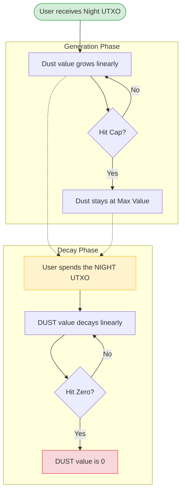
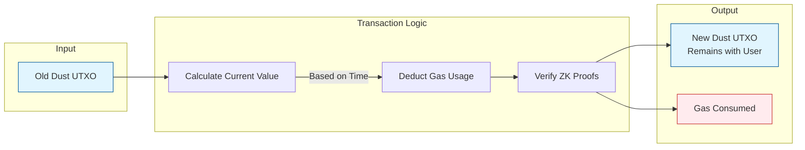

# DUST architecture

DUST 아키텍처를 이해할 때는 다음 비유가 도움이 됩니다.

- **NIGHT**: *태양광 패널*에 해당합니다. 사용자가 보유하는 가치 있는 자산입니다.
- **DUST**: *전기*에 해당합니다. 태양광 패널(NIGHT)이 만들어 내는 컴퓨팅 처리량 또는 가스를 의미합니다.
- **Usage**: 네트워크에서 작업을 수행하기 위해 전기(DUST)를 가스로 소비합니다.

"코인 5개를 보유하고 있다"처럼 잔액이 정적인 일반 암호화폐와 달리, DUST 잔액은 시간과 NIGHT 토큰 상태에 따라 동적으로 변합니다.

## DUST and network usage

DUST는 [Zswap](https://github.com/midnightntwrk/midnight-ledger/blob/main/spec/zswap.md)과 비슷하게 동작하지만 별도로 운영됩니다. DUST는 Midnight의 리소스 크레딧 시스템 역할을 합니다.

- **차폐 및 양도 불가**: DUST는 가스 *전용*으로 차폐된 용량 리소스입니다. 사용자 간 전송은 불가능합니다.
- **동적 용량**: DUST UTXO에서 사용 가능한 가스는 연관된 NIGHT UTXO를 기반으로 동적으로 계산됩니다.
- **생성과 소멸**: 계산된 값은 NIGHT UTXO에 따른 최댓값까지 시간이 흐르며 증가하고, NIGHT UTXO가 소비되면 0까지 감소합니다.
- **비영속적**: 시스템이 하드포크 시점에 재분배할 수 있습니다.

:::note

Midnight 프로토콜은 가비지 컬렉션 등을 위해 DUST 할당 규칙을 변경할 권리를 보유합니다.

:::

## Design overview

Zswap과 마찬가지로 DUST는 해시와 커밋먼트/널리파이어 패러다임 위에 구축됩니다. 각 DUST UTXO는 생성 시 추가 전용(append-only) 머클 트리에 삽입되는 **커밋먼트**를 가지며, 소비 시에는 널리파이어 집합에 추가되는 **널리파이어**를 가집니다.

DUST의 "소비(spend)"는 1대1 "전송"(자기 전송, Self-Spend)입니다.

- **입력**: DUST UTXO 1개 (널리파이어)
- **출력**: DUST UTXO 1개 (커밋먼트)
- **수수료**: 지불된 수수료에 대한 공개 선언

여기에는 다음을 증명하는 영지식 증명이 포함됩니다.

- 입력이 유효하며 머클 트리에 존재합니다.
- 출력 값은 *업데이트된* 입력 값에서 소비된 가스를 뺀 값과 같습니다.
- 출력 널리파이어가 올바르며, 소유자는 동일하게 유지됩니다.

### Lifecycle: NIGHT generates DUST

개념적으로 DUST를 보유한 NIGHT UTXO는 시간이 지남에 따라 DUST를 생성합니다. 백킹 NIGHT UTXO가 소비되지 않는 한, 연관된 DUST UTXO는 상한($\rho$)까지 가치를 생성합니다. 백킹 NIGHT이 소비되면 DUST UTXO는 0으로 "소멸(decay)"됩니다.

다음 다이어그램은 이 라이프사이클을 보여 줍니다.



생성 속도는 보유한 NIGHT 양($N$), DUST 상한과 NIGHT 보유량의 비율($\rho$), "상한까지 도달하는 시간"($\Delta$)에 따라 결정됩니다.

#### Spending rules

소비 규칙은 다음과 같습니다.

* DUST는 여러 번 소비할 수 있으며, 값이 0이더라도 항상 새 UTXO가 생성됩니다.
* 소멸 단계에서도 DUST를 소비할 수 있으며, 이 경우 소멸 속도는 변하지 않습니다.
* 백킹 NIGHT이 소비되면, 아직 생성 단계에 있더라도 DUST는 즉시 소멸을 시작합니다.
* NIGHT의 일부만 소비되면, 잔돈으로 새 NIGHT UTXO가 만들어져(새로운 DUST 생성을 시작) 기존 DUST UTXO는 소멸됩니다.

#### Implementation note

실제 구현에서는 값을 연속적으로 처리하지 않습니다. 대신 메타데이터("generation info")를 사용해 *소비 시점에* 값을 계산합니다.

- DUST UTXO의 생성 시각
- 백킹 NIGHT UTXO의 생성 시각
- 백킹 NIGHT UTXO의 삭제 시각

DUST와 NIGHT은 서로 다른 키를 사용하므로, **등록 테이블(Registration Table)**이 NIGHT 공개 키와 DUST 공개 키를 연결합니다. NIGHT UTXO가 생성되고 *동시에* 해당 키가 테이블에 등록되어 있을 때만 새 DUST UTXO가 생성됩니다.

#### The grace period

DUST 사용은 차폐되어 있으므로, 시스템은 *트랜잭션 생성 시점*을 기준으로 값을 계산합니다. 네트워크 지연을 고려해 프로토콜은 *DUST Grace Period*(예: 3시간)를 정의합니다. 트랜잭션의 타임스탬프가 블록 시간 기준으로 이 범위 내에 있으면 수락됩니다.

## Preliminaries

DUST는 ZK 친화적 해시를 사용합니다.

```rust
type DustSecretKey = Fr;
type DustPublicKey = field::Hash<DustSecretKey>;
```

DUST UTXO는 소유자, 값, *논스(nonce)*를 가집니다. 논스는 지갑 복구가 가능하도록 결정적인 방식으로 변화합니다.

  * **첫 번째 DUST UTXO**: 논스는 원본 NIGHT UTXO의 인텐트 해시에서 파생됩니다.
  * **이후 DUST UTXO**: 논스는 이전 시퀀스 번호와 소유자의 비밀 키에서 파생됩니다.

```rust
struct DustOutput {
    initial_value: u128,   // Specks at creation
    owner: DustPublicKey,
    nonce: field::Hash<(InitialNonce, u32, Fr)>,
    seq: u32,
    ctime: Timestamp,
}
```

상태 구성 요소에는 커밋먼트 트리, 널리파이어 집합, 루트 히스토리가 포함됩니다.

```rust
struct DustUtxoState {
    commitments: MerkleTree<DustCommitment>,
    commitments_first_free: usize,
    nullifiers: Set<DustNullifier>,
    root_history: TimeFilterMap<MerkleTreeRoot>,
}
```

## Initial DUST parameters

DUST와 NIGHT은 서로 다른 단위를 사용합니다. 각 단위와 초기 파라미터는 다음과 같습니다.

* **NIGHT 단위**: `Star (1 NIGHT = 10^6 Stars)`
* **DUST 단위**: `Speck (1 DUST = 10^15 Specks)`

```rust
const INITIAL_DUST_PARAMETERS: DustParameters = {
    night_dust_ratio = 5_000_000_000; // 5 DUST per NIGHT
    generation_decay_rate = 8_267; // ~1 week generation time
    dust_grace_period = Duration::from_hours(3),
};
```

## DUST actions

사용자는 *인텐트(Intents)*를 통해 DUST 상태에 영향을 줍니다.

```rust
struct DustActions<S, P> {
    spends: Vec<DustSpend<P>>,
    registrations: Vec<DustRegistration>,
    ctime: Timestamp,
}
```

### Registrations and fees

`DustRegistration`은 NIGHT 키를 DUST 키에 연결합니다.

  * 등록은 순차적으로 처리됩니다.
  * 등록 트랜잭션이 *아직 DUST를 생성하지 않은* NIGHT 입력(즉, 이전 등록 기록이 없는 입력)을 사용하는 경우, 시스템은 해당 입력이 *생성했을* DUST로 가스 비용을 지불하도록 등록을 "소급 적용"할 수 있습니다.

## Generate DUST

NIGHT 입력/출력은 *DUST Generation Tree*에 대한 업데이트를 트리거합니다.

  * **DustGenerationInfo**: NIGHT의 양, 소유자, `dtime`(삭제 시각)을 저장합니다.
  * **Address map**: NIGHT 주소와 DUST 주소를 연결합니다.

```rust
struct DustGenerationInfo {
    value: u128,
    owner: DustPublicKey,
    nonce: InitialNonce,
    dtime: Timestamp, // Set to MAX if Night is unspent
}
```

## DUST value and spends

DUST UTXO의 값은 네 개의 선형 시간 구간을 기준으로 계산됩니다.

1. **Generating**: 생성 시점부터 용량 도달(또는 NIGHT 소비) 시점까지.
2. **Constant (maximum)**: 용량 도달 후 NIGHT 소비 전까지.
3. **Decaying**: NIGHT 소비 시점부터 값이 0에 도달할 때까지.
4. **Constant (zero)**: 그 이후로 영구히.

### The spend transaction

`DustSpend`는 UTXO를 소비하고, 업데이트된 값에서 수수료를 차감한 새 UTXO를 만듭니다.



검증 로직(`dust_spend_valid`)은 다음을 확인합니다.

  * `commitment_merkle_tree`에 입력이 포함되어 있는지.
  * `dust_spend.old_nullifier`가 파생된 널리파이어와 일치하는지.
  * `updated_value`가 수수료를 충당하기에 충분한지.
  * `new_commitment`이 올바르게 구성되었는지.

## Wallet recovery

지갑은 다음 과정으로 자금을 복구합니다.

- 보유 중인 NIGHT UTXO를 식별합니다(체인의 시작점).
- 시퀀스 번호($0, 1, 2...$)에 대응하는 커밋먼트를 선형적으로 탐색합니다.
- **프라이버시**: 지갑은 인덱싱 서비스에 대한 프라이버시를 보호하기 위해, 정확한 조회 대신 비트 접두사 기반(확률적 필터링) 쿼리를 사용해야 합니다.

## The implementation

이 섹션에서는 Cardano NIGHT 토큰을 기반으로 한 DUST 생성 구현을 설명합니다.

### DUST generation from Cardano NIGHT token

Cardano *NIGHT* 토큰(cNIGHT)으로부터의 *DUST* 생성은 Midnight 파트너 체인에서 *Native Token Observation Pallet*(`pallet_cnight_observation`)이 관리하는 크로스체인 프로세스입니다.


### Summary of the full flow

1/ 사용자가 Cardano에서 보상 주소와 DUST 공개 키를 등록합니다.

2/ 해당 주소에서 cNIGHT UTXO가 생성(수신)되거나 소비(전송)될 때마다 이벤트가 브로드캐스트됩니다.

3–4/ Midnight 팔레트는 정확히 하나의 유효한 등록이 존재하는지 검증한 뒤 cNIGHT 활동을 관찰합니다.

5–6/ 수신(생성)인지 전송(소멸)인지 판별하여 그에 해당하는 DUST 생성 또는 소멸 이벤트를 만듭니다.

7–9/ 한 블록 내의 모든 이벤트를 모아 LedgerApi를 통해 단일 시스템 트랜잭션으로 래핑하고, 이를 Midnight 원장에서 실행합니다.

→ **최종 결과**: DUST 공급량과 UTXO가 Cardano의 cNIGHT 이동과 1:1로 동기화됩니다.

## Next steps

DUST 개요를 살펴봤다면, 이제 GitHub의 [DUST 사양](https://github.com/midnightntwrk/midnight-ledger/blob/main/spec/dust.md)도 함께 확인해 보세요.

GitHub의 [구현 코드](https://raw.githubusercontent.com/midnightntwrk/midnight-node/refs/heads/main/primitives/mainchain-follower/src/data_source/cnight_observation.rs)를 살펴보고 직접 기여할 수도 있습니다.
