여러분의 기기는 Midnight 트랜잭션을 비공개로 연산하고 그것이 올바름을 증명합니다. 그 다음에야 네트워크가 공개적으로 검증합니다. private data는 연산에 참여하지만 체인에는 결코 도달하지 않습니다. 경계를 넘는 것은 실행에 대한 공개 기록과, 그것이 올바르다는 zero-knowledge proof입니다.

이 페이지는 그 여정 전체를 하나의 다이어그램으로 잇습니다. 각 단계는 해당 내용을 깊이 다루는 페이지로 링크됩니다.

## The complete flow

```mermaid
flowchart TB
    accTitle: Midnight end-to-end architecture
    accDescr: A transaction flows from the private domain on your device (private state, witness functions, local circuit execution, proof generation, wallet balancing) across the network boundary (public transcripts, proofs, commitments, nullifiers) into the public domain (transaction pool checks, guaranteed and fallible execution, ledger state updates) and out through the indexer read layer.
    subgraph DEVICE["Your device: the private domain"]
        direction TB
        DAPP["DApp invokes a circuit"]
        PS[("Private state<br/>stored locally")]
        WIT["Witness functions<br/>supply private inputs"]
        CIRC["Circuit executes locally<br/>(compiled from Compact)"]
        PRIVT["Private transcript<br/>stays on the device"]
        PUBT["Public transcripts:<br/>the public record of execution<br/>(guaranteed and fallible sections)"]
        PROVE["Proof server generates the ZK proofs<br/>(you choose where it runs; a remote<br/>proof server sees your witness values)"]
        WALLET["Wallet balances the transaction:<br/>adds the coin inputs and outputs needed<br/>to cover value imbalance, and attaches<br/>the DUST fee payment"]
        DAPP --> CIRC
        PS --> WIT
        WIT --> CIRC
        WIT -.->|updates*| PS
        CIRC --> PRIVT
        CIRC --> PUBT
        PRIVT --> PROVE
        PUBT --> PROVE
        PROVE --> WALLET
    end

    TX["What crosses to the network:<br/>contract address and entry point,<br/>public transcripts, ZK proofs,<br/>commitments, nullifiers,<br/>encrypted coin info for recipients<br/>(output ciphertexts)<br/><br/>What never reaches the network:<br/>private state, witness values,<br/>secret keys, the private transcript"]

    subgraph NETWORK["Midnight network: the public domain"]
        direction TB
        POOL["Transaction pool:<br/>well-formedness check.<br/>Proofs verified against verifier keys<br/>stored on chain; balance checks"]
        EXEC["Block inclusion:<br/>guaranteed phase, then fallible phase.<br/>Impact VM confirms the declared<br/>effects match execution"]
        LEDGER[("Ledger state updates:<br/>contract public state,<br/>commitment Merkle tree grows,<br/>nullifiers inserted into the nullifier set,<br/>duplicates rejected (double-spend protection)")]
        POOL --> EXEC
        EXEC --> LEDGER
    end

    subgraph READ["Read layer"]
        direction TB
        IDX["Indexer serves public data:<br/>blocks, transactions,<br/>contract actions, public state"]
        VIEW["A wallet holding a viewing key<br/>can additionally decrypt<br/>its own shielded history"]
        IDX --> VIEW
    end

    WALLET ==> TX
    TX ==> POOL
    LEDGER --> IDX
    VIEW -.->|"query results"| DAPP
```

\* 갱신된 private state는 트랜잭션이 성공한 뒤에만 기기에 유지됩니다.

## What each layer can and cannot see

| Layer | 볼 수 있는 것 | 볼 수 없는 것 |
|---|---|---|
| 체인 관찰자(누구나) | 컨트랙트 주소, 트랜잭션이 호출한 circuit, public transcript, ledger 연산 인자, 공개된 값, commitment, nullifier, 블록 타이밍 | witness 반환값(공개 위치로 disclose되지 않은 한), private state, 내부 연산, Compact `MerkleTree`에 삽입된 값(엔트로피가 낮으면 추측 가능), 주어진 nullifier가 어떤 commitment을 소비하는지 |
| 노드(밸리데이터) | 체인 관찰자와 동일, 여기에 mempool 타이밍 추가 | 체인 관찰자와 동일 |
| Indexer | 체인상의 모든 것(공개 데이터를 인덱싱함) | private state, witness 값. commitment을 열 수 없음 |
| Indexer(여러분의 viewing key 사용 시) | 여러분 자신의 shielded 트랜잭션 이력(복호화 전용 접근. indexer 운영자도 이를 알게 됨) | 다른 사용자의 shielded 데이터. viewing key로는 소비하거나 서명할 수 없음 |
| Proof server | witness 값을 포함해 proof 요청에 담긴 모든 것. 이는 신뢰 경계입니다. 직접 운영하세요. wallet 위임 proving을 쓰면 proving 단계가 지갑이 사용하는 proof server로 옮겨갑니다 | 없음. 전체 요청을 봅니다 |

## Go deeper into each stage

- 트랜잭션 구조, offer, binding: [Building blocks](./building-blocks)
- 컨트랙트가 local·circuit·ledger 부분으로 나뉘는 방식과 transcript가 무엇인지: [Smart contracts](./smart-contracts)
- well-formedness, guaranteed·fallible 단계, ledger state 갱신: [Transaction semantics](./semantics)
- commitment, nullifier, 그리고 데이터를 비공개로 유지하는 기법들: [Keeping data private](./keeping-data-private)
- 트랜잭션이 노드를 거쳐 이동하는 방식: [Transactions on the network](../network-architecture/transactions)
- 체인에 정확히 무엇이 보이는지, 그리고 proof server·indexer 신뢰 경계: [Security and best practices](../../guides/security-best-practices)
- 같은 흐름을 SDK 관점에서 provider별로: [Midnight.js](/sdks/official/midnight-js)
