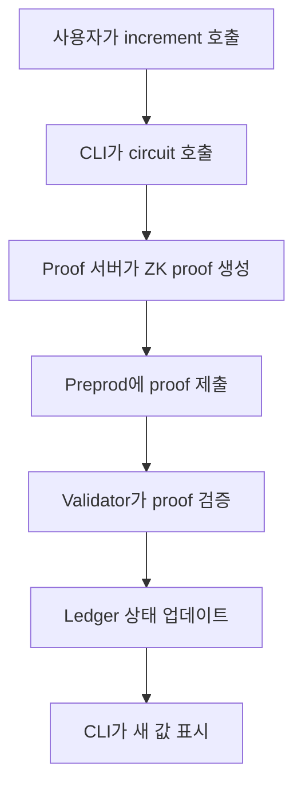

# Counter DApp

Counter 컨트랙트는 Compact 언어를 사용한 Midnight 개발의 기초를 시연합니다. 영지식 증명 기반으로 카운터 값을 유지하고 증가시키는 간단한 스마트 컨트랙트를 만드는 방법을 다룹니다.

Counter 예제는 핵심 Midnight 개념을 소개하는 최소 구성의 DApp입니다:

- Compact로 스마트 컨트랙트 작성
- Preprod 네트워크에 컨트랙트 배포
- CLI를 통한 배포된 컨트랙트와의 상호작용
- 상태 전환을 위한 영지식 증명 사용

이 가이드를 마치면 Counter 컨트랙트의 작동 방식, 배포 방법, 커맨드 라인을 통한 상호작용 방법을 파악할 수 있습니다.

## Contract architecture

Counter 예제는 두 가지 주요 컴포넌트로 구성됩니다:

```
example-counter/
├── contract/                  # Compact 언어로 된 smart contract
│   ├── src/counter.compact    # 실제 smart contract
│   └── src/test/              # Contract 유닛 테스트
└── counter-cli/               # 커맨드 라인 인터페이스
    └── src/                   # CLI 구현
```

### Counter contract

Counter 컨트랙트는 Compact로 작성되었으며 다음 컴포넌트를 포함합니다:

**Ledger 상태**: 온체인 카운터 값을 유지하는 `round`라는 단일 `Counter` 타입입니다. Counter 타입은 자동으로 0으로 초기화되며 증가 연산을 위한 내장 메서드를 제공합니다.
**Circuit**: 컨트랙트의 진입점 역할을 하는 하나의 export circuit입니다. `increment()`라는 이름으로, `round.increment(1)` 메서드를 사용하여 카운터 값을 1 증가시킵니다.

전체 컨트랙트는 다음과 같습니다:

```compact
pragma language_version 0.21;

import CompactStandardLibrary;

// 공개 상태(public state)
export ledger round: Counter;

// 공개 상태를 변경하는 전환 함수
export circuit increment(): [] {
  round.increment(1);
}
```

이 컨트랙트는 여러 주요 Compact 개념을 시연합니다:

- **언어 버전 지시문**: 컨트랙트가 요구하는 Compact 버전을 지정합니다
- **표준 라이브러리 임포트**: `Counter` 같은 내장 타입을 사용할 수 있습니다
- **Ledger 선언**: 컨트랙트의 온체인 상태를 정의합니다
- **Export 키워드**: circuit를 외부 코드에서 호출 가능하게 하여 배포된 컨트랙트에 포함시킵니다
- **Unit 타입 `[]`**: 반환 값이 없는 circuit를 나타냅니다

### Zero Knowledge proofs in action

`increment()`를 호출하면 다음 과정이 진행됩니다:

1. 로컬 머신에서 circuit 로직이 실행됩니다.
2. proof 서버가 연산의 정확성을 증명하는 영지식 증명을 생성합니다.
3. 증명이 Preprod 네트워크에 제출됩니다.
4. 검증자가 개인 데이터를 보지 않고 증명을 검증합니다.
5. 증명이 유효하면 ledger 상태가 업데이트됩니다.

## Prerequisites

Counter 예제를 시작하기 전에 다음 사항을 확인하세요:

- Node.js 버전 22 이상
- Docker Desktop 설치 및 실행 중
- Compact 툴체인 설치 완료
- 커맨드 라인 사용 경험

자세한 내용은 [툴체인 설치](../../getting-started/installation)를 참조하세요.

## Set up the example

Counter DApp을 로컬에서 설정하고 실행하는 방법을 안내합니다.

### Clone the repository

GitHub에서 Counter 예제를 클론합니다:

```bash
git clone https://github.com/midnightntwrk/example-counter.git
cd example-counter
```

### Install dependencies

필요한 모든 Node.js 패키지를 설치합니다:

```bash
npm install
```

컨트랙트와 CLI 컴포넌트의 패키지가 모두 설치됩니다. 일부 경고가 나타날 수 있지만 오류가 없으면 정상입니다.

## Start the proof server

proof 서버는 개인 데이터 보호를 위해 트랜잭션의 영지식 증명을 로컬에서 생성합니다. 컨트랙트 배포나 상호작용 시 반드시 실행 중이어야 합니다.

다음 명령으로 Preprod용 proof 서버를 시작합니다:

```bash
docker run -p 6300:6300 midnightntwrk/proof-server:7.0.0 -- midnight-proof-server -v
```

다음과 유사한 출력이 표시됩니다:

```
starting service: "actix-web-service-0.0.0.0:6300", workers: 14, listening on: 0.0.0.0:6300
```

:::tip 실행 상태 유지
이 터미널 창을 열어두세요. DApp을 사용하는 동안 proof 서버가 _반드시_ 실행 중이어야 합니다.
:::

## Compile the contract

새 터미널을 열고 `contract` 디렉토리로 이동합니다:

```bash
cd contract
```

다음 스크립트로 컨트랙트를 컴파일합니다:

```bash
npm run compact
```

`npm run compact`는 내부적으로 다음 명령을 실행합니다:

```bash
compact compile src/counter.compact src/managed/counter
```

컨트랙트를 컴파일하여 TypeScript API와 JavaScript 구현을 생성합니다.

다음과 같은 출력이 표시됩니다:

```
> compact compile src/counter.compact src/managed/counter

Compiling 1 circuits:
  circuit "increment" (k=5, rows=24)
```

컴파일된 아티팩트는 `src/managed/counter` 디렉토리에 저장됩니다.

```
src/
├── counter.compact
├── managed
│   └── counter
│       ├── compiler
│       ├── contract
│       ├── keys
│       └── zkir
```

## Launch the Counter CLI

새 터미널을 열고 `counter-cli` 디렉토리로 이동합니다:

```bash
cd counter-cli
```

`counter-cli` 폴더의 `package.json`에 Preprod 네트워크용 `preprod` 스크립트가 정의되어 있습니다.

다음 명령으로 CLI를 시작합니다.

```bash
npm run preprod
```

CLI가 시작 화면을 표시합니다:

```
╔══════════════════════════════════════════════════════════════╗
║                                                             ║
║              Midnight Counter Example                       ║
║              ────────────────────────                       ║
║              A privacy-preserving smart contract demo       ║
║                                                             ║
╚══════════════════════════════════════════════════════════════╝


──────────────────────────────────────────────────────────────
  Wallet Setup
──────────────────────────────────────────────────────────────
  [1] Create a new wallet
  [2] Restore wallet from seed
  [3] Exit
──────────────────────────────────────────────────────────────
```

## Set up your wallet

Counter CLI는 Lace Midnight Preview 같은 브라우저 wallet과는 별도로, 로컬에서 실행되는 헤드리스 wallet을 사용합니다.

### Create a new wallet

메뉴에서 `[1] Create a new wallet` 옵션을 선택합니다.

CLI가 새 wallet을 생성하고 wallet 개요를 표시합니다:

```
──────────────────────────────────────────────────────────────
  Wallet Overview                            Network: preprod
──────────────────────────────────────────────────────────────
  Seed: [64자 16진수 문자열]

  Unshielded Address (send tNight here):
  mn_addr_preprod1...

  Fund your wallet with tNight from the Preprod faucet:
  https://faucet.preprod.midnight.network/
──────────────────────────────────────────────────────────────
```

:::warning 시드를 안전하게 보관하세요
wallet 시드를 안전한 곳에 저장하세요. wallet 복구 시 시드가 필요합니다.
:::

### Restore an existing wallet

이미 wallet 시드가 있다면 `[2] Restore wallet from seed` 옵션을 선택합니다.

프롬프트에 wallet 시드를 입력합니다:

```
> 2
Enter your wallet seed: bbee2c8886837784............

  ✓ Building wallet
```

CLI가 wallet을 복원하고 주소와 잔액을 표시합니다.

## Get faucet tokens

컨트랙트를 배포하려면 먼저 faucet에서 tNight 토큰을 받아야 합니다.

1. wallet 개요에서 비차폐 주소를 복사합니다.
2. [Preprod faucet](https://faucet.preprod.midnight.network/)를 방문합니다.
3. 비차폐 주소를 붙여넣습니다.
4. 토큰을 요청합니다.
5. 트랜잭션이 확인될 때까지 기다립니다. 보통 1~2분 소요됩니다.

동기화 후 CLI가 업데이트된 잔액을 표시합니다:

```
──────────────────────────────────────────────────────────────
  Wallet Overview                            Network: preprod
──────────────────────────────────────────────────────────────
  Seed: bbee2c8886837784............
──────────────────────────────────────────────────────────────

  Shielded (ZSwap)
  └─ Address: mn_shield-addr_preprod1...

  Unshielded
  ├─ Address: mn_addr_preprod12gseaq...
  └─ Balance: 2,000,000,000 tNight

  Dust
  └─ Address: mn_dust_preprod1w0darle...

──────────────────────────────────────────────────────────────
  ✓ Dust tokens already available (4,693,721,522,000,000,000 DUST)
  ✓ Configuring providers
```

wallet이 tNight 보유량에서 컨트랙트 운영에 필요한 DUST 토큰을 자동으로 생성합니다.

## Deploy the contract

wallet에 자금이 충전되면 Counter 컨트랙트를 Preprod에 배포할 수 있습니다.

Contract Actions 메뉴에서 `[1] Deploy a new counter contract` 옵션을 선택합니다:

```
──────────────────────────────────────────────────────────────
  Contract Actions                    DUST: 4,693,721,522,000,000,000
──────────────────────────────────────────────────────────────
  [1] Deploy a new counter contract
  [2] Join an existing counter contract
  [3] Monitor DUST balance
  [4] Exit
──────────────────────────────────────────────────────────────
> 1
```

CLI가 컨트랙트를 배포하고 컨트랙트 주소를 표시합니다:

```
[11:44:34.335] INFO (10378): Deploying counter contract...
  ⠋ Deploying counter contract
[11:44:58.724] INFO (10378): Deployed contract at address: ea87c25015951b..........
  ✓ Deploying counter contract
  Contract deployed at: ea87c25015951b..........
```

:::note 트랜잭션 소요 시간
컨트랙트 배포는 네트워크에서 트랜잭션과 영지식 증명을 처리해야 하므로, Preprod에서 보통 20~30초 정도 걸립니다.
:::

## Interact with the contract

배포가 완료되면 Counter 컨트랙트와 상호작용할 수 있습니다.

Counter Actions 메뉴가 나타납니다:

```
──────────────────────────────────────────────────────────────
  Counter Actions                     DUST: 4,693,901,007,999,999,999
──────────────────────────────────────────────────────────────
  [1] Increment counter
  [2] Display current counter value
  [3] Exit
──────────────────────────────────────────────────────────────
```

### Check the current value

`[2] Display current counter value` 옵션을 선택하여 현재 카운터 값을 확인합니다:

```
> 2
INFO (10378): Checking contract ledger state...
INFO (10378): Ledger state: 0
INFO (10378): Current counter value: 0
```

컨트랙트가 배포되면 카운터는 0으로 초기화됩니다.

### Increment the counter

메뉴에서 `[1] Increment counter` 옵션을 선택합니다. CLI가 수행하는 작업:

1. 로컬에서 영지식 증명을 생성합니다
2. 증명을 Preprod에 제출합니다
3. 트랜잭션 확인을 기다립니다
4. DUST 잔액을 업데이트합니다

```
> 1
 INFO (10378): Incrementing...
  ⠇ Incrementing counter
 INFO (10378): Transaction 00fe2faaa99f71216162d2c850123ea067d74e08e77fef1d7d4c534a256e55de8f added in block 262860
  ✓ Incrementing counter

──────────────────────────────────────────────────────────────
  Counter Actions                     DUST: 4,699,057,227,999,999,998
──────────────────────────────────────────────────────────────
  [1] Increment counter
  [2] Display current counter value
  [3] Exit
──────────────────────────────────────────────────────────────
```

:::info 트랜잭션 세부 정보
각 증가는 Midnight Preprod에서 실제 트랜잭션을 생성합니다. 트랜잭션에는 개인 정보를 공개하지 않으면서 카운터가 올바르게 증가되었음을 증명하는 영지식 증명이 포함됩니다.
:::

### Verify the increment

`[2] Display current counter value` 옵션을 다시 선택하여 증가를 확인합니다:

```
> 2
INFO (10378): Checking contract ledger state...
INFO (10378): Ledger state: 1
INFO (10378): Current counter value: 1
```

카운터 값이 1로, 증가 연산이 성공했음을 확인할 수 있습니다.

## Understand the workflow

Counter 예제는 Midnight DApp의 전체 워크플로를 보여 줍니다:

<div style={{display: 'flex', justifyContent: 'center'}}>



</div>

### Key concepts demonstrated

- **공개 ledger 상태**: 카운터 값은 공개이며 온체인에서 누구나 조회할 수 있지만, 유효한 증명을 가진 사람만 수정할 수 있습니다.
- **영지식 증명**: 각 상태 전환은 개인 데이터를 공개하지 않고 로컬에서 증명됩니다. 검증자는 연산 세부 정보를 보지 않고 증명을 수락합니다.
- **Circuit 진입점**: `increment()` circuit는 올바른 상태 전환을 강제하는 영지식 circuit로 컴파일됩니다.
- **원자적 연산**: 각 circuit 호출은 단일 원자적 트랜잭션입니다. 어떤 부분이든 실패하면 전체 트랜잭션이 거부되고 상태는 변경되지 않습니다.

## Extend the example

Counter 예제를 기반으로 더 복잡한 DApp을 구축할 수 있습니다. 다음과 같은 개선을 시도해 보세요.

### Add custom increment amounts

매개변수를 받도록 circuit를 수정합니다:

```compact
export circuit incrementBy(amount: Uint<8>): [] {
  round.increment(amount);
}
```

### Add a decrement circuit

감소 기능을 구현합니다:

```compact
export circuit decrement(): [] {
  round.decrement(1);
}
```

:::caution 0 미만으로 감소 불가
Counter 타입은 음수 값을 허용하지 않습니다. 0 미만으로 감소시키려 하면 런타임 오류가 발생하며 컨트랙트가 이를 거부합니다.
:::

## Next steps

Counter 예제를 이해했다면 다음 단계를 진행해 보세요:

- **GitHub 저장소 탐색**: [Counter 저장소](https://github.com/midnightntwrk/example-counter)
- **직접 컨트랙트 빌드하기**: [counter 스마트 컨트랙트 빌드](../../tutorials/counter/smart-contract) 방법을 알아보세요.

