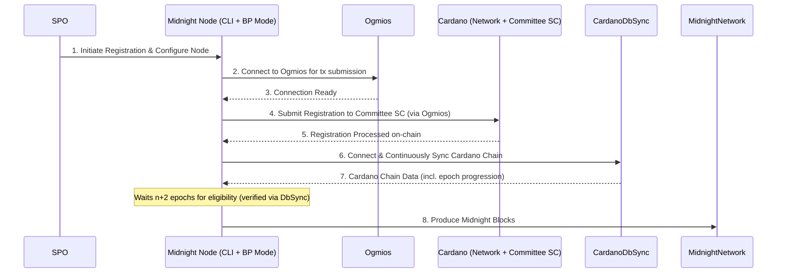
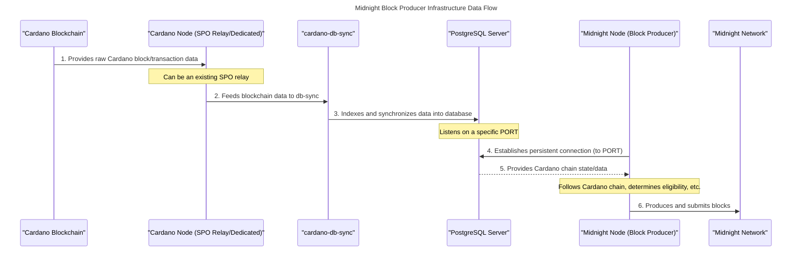

---
---

import vidThumbnail from './images/vid_thumb_become_producer.png';

# Become a Midnight Block Producer

Midnight Validator가 되는 과정을 안내하는 문서입니다. Validator는 Midnight blockchain에서 새로운 블록을 생성하는 역할을 담당합니다. Validator는 blockchain의 무결성, 보안, 기능 유지에 핵심적인 역할을 합니다.

<iframe
  width="100%"
  height="400"
  src="https://www.youtube.com/embed/aKNoR09AU1Q"
  title="Introduction to Midnight and the Midnight Developer Academy"
  frameBorder="0"
  allow="accelerometer; autoplay; clipboard-write; encrypted-media; gyroscope; picture-in-picture"
  allowFullScreen
></iframe>

## Prerequisites

#### Must-have skills
- blockchain 노드를 안정적으로 설정, 운영, 모니터링할 수 있는 능력
- CLI 사용, 시스템 관리, 네트워킹에 대한 숙련도
- blockchain 기술, 특히 Cardano stake pool 운영 경험

#### Nice-to-have skills
- 자동화를 위한 스크립팅 언어(예: Bash, Python) 활용 능력
- blockchain 인프라 보안 모범 사례에 대한 이해

#### Must-have gear
- 다운타임이 최소화된 안정적인 인터넷 연결. 50 MB/s 이상이면 충분합니다.
- 풀 노드를 실행할 수 있는 적절한 하드웨어(CPU, RAM, 스토리지 요구사항은 최신 문서 참조)

#### Nice-to-have gear
- 고가용성을 위한 이중화 인터넷 연결
- 정전 시 다운타임 방지를 위한 백업 전원 공급 장치

:::info

오프라인 시 slashing은 없으며, 추가 블록 보상을 받지 못하는 기회비용만 발생합니다.

:::

:::info

체인 리셋 없이 Midnight을 발전시키기 위해, 새 버전의 노드 소프트웨어에는 hard fork 또는 soft fork가 필요한 변경 사항이 포함될 수 있습니다. 이러한 상황을 원활하게 처리하기 위해, 호환되는 버전의 소프트웨어를 실행하는 validator 노드는 생성하는 블록에 관련 정보를 포함하기 시작합니다. 이 정보를 포함한 블록이 설정된 임계값에 도달하면, 변경 사항이 예약되고 런타임 업그레이드를 통해 적용됩니다.

:::

##  Midnight Block Production Overview



Midnight block producer가 되려면, 먼저 Cardano Stake Pool Operator(SPO)로 운영 중이어야 합니다. 이 기본 요건은 blockchain 운영과 인프라 관리에 대한 기초 역량을 보장합니다.

SPO 요건을 충족한 후, Midnight Block Producer Committee에 후보자로 등록할 수 있습니다. 이 committee는 Cardano blockchain의 smart contract로 구현되어 있으며, 각 epoch에서 블록 생성을 위한 SPO의 교체 및 선정을 관리합니다. 등록은 Midnight 노드 소프트웨어에서 제공하는 간단한 CLI 명령어로 진행됩니다.

등록 완료 후 최종 운영 단계는 Midnight 노드를 block producer 모드로 설정하고 실행하는 것입니다. 이 모드에서는 Midnight 노드와 cardano-db-sync가 실행되는 PostgreSQL 인스턴스 간의 지속적인 연결이 필요합니다. 이 연결은 Midnight 노드가 Cardano blockchain을 정확하게 추적하고 동기화하는 데 필수적입니다.

블록 생성 자격은 보통 등록 완료 후 약 2 Cardano epoch(n+2) 뒤에 확정됩니다. 이 시점부터 등록된 Midnight 노드가 블록 생성에 참여하게 됩니다.

## System requirements and software



표준 Cardano Stake Pool과 함께 Midnight block producer를 운영하려면, 여러 핵심 서비스를 지속적으로 실행해야 하며, 하나의 구성 요소는 간헐적으로만 사용합니다.

다음 서비스는 지속적으로 실행해야 합니다:

- **PostgreSQL Server**: Midnight 노드가 Cardano blockchain을 정확하게 추적할 수 있도록 PostgreSQL 포트를 제공합니다.

- **Cardano-db-sync**: Cardano blockchain의 실시간 데이터를 PostgreSQL 데이터베이스에 동기화하는 역할을 합니다.

- **Cardano-node**: Cardano-db-sync는 Cardano-node에서 Cardano 데이터베이스를 인덱싱합니다. 운영자는 기존 Cardano SPO 구성의 Cardano 노드(relay)를 재활용할 수 있습니다.

- **Midnight Node** (Block Producer Mode): PostgreSQL에 지속 연결하여 Cardano 체인을 추적하며, Midnight 네트워크의 블록을 적극적으로 생성합니다.

추가로, **Ogmios**는 Cardano 체인에 등록 트랜잭션을 제출하는 등의 특정 Partner-Chain CLI 명령에 일시적으로 사용됩니다. 지속 실행은 필요하지 않습니다.

대부분의 노드 운영자는 워크스테이션에서 서버와 인프라를 원격으로 관리합니다. 현재 Mac과 Linux가 권장 및 테스트 완료된 운영 체제입니다. Windows 워크스테이션을 사용하는 경우, 호환성을 위해 Windows Subsystem for Linux(WSL)를 사용하세요.

WSL을 사용하는 경우 다음을 사용하세요:

* Ubuntu 22.04 (또는 동등한 버전)
    * [GLIBC](https://www.gnu.org/software/libc/) 2.35

현재 GLIBC 버전을 WSL에서 확인하세요:

```bash
ldd --version
```

Docker는 이 가이드 전체에서 사용되는 핵심 도구입니다. 컨테이너 관리를 간소화하기 위해 워크스테이션과 서버 모두에 Docker를 설치하는 것을 권장합니다. Docker는 애플리케이션을 컨테이너라는 표준화된 단위로 패키징하여 배포, 확장, 관리를 단순화하고, 다양한 환경 간의 일관성을 유지하기 쉽게 합니다.

- Docker 공식 웹사이트에서 [Docker를 설치](https://docs.docker.com/get-docker/)하세요.

### Versioning compatibility

[호환성 매트릭스](/relnotes/support-matrix)를 참조하세요.

### Estimated hardware requirements

Midnight validator 인프라에서 사용되는 각 서비스의 예상 시스템 요구사항입니다.

버전 정보가 포함된 업데이트 테이블입니다:

| Service            | Quantity | CPU `testnet` | CPU `mainnet` | Memory `testnet` | Memory `mainnet` | Storage `testnet`  | Storage `mainnet`        |
|--------------------|----------|---------------|---------------|------------------|------------------|-------------------|--------------------------|
| **Cardano DB Sync**| 1        | 4 VCPU        | 4 VCPU        | 32 GB RAM        | 32 GB RAM        | 20 GB free         | 320 GB free              |
| **Cardano Node** | 2        | 2 VCPU        | 4 VCPU        | 4 GB RAM         | 16 GB RAM        | 20 GB free         | 250 GB free              |
| **PostgreSQL** | 1        | 0.5 VCPU      | 1 VCPU        | 1 GB RAM         | 1 GB RAM         | -                  | -                        |
| **Midnight Node** | 1        | 4 VCPU        | 8 VCPU        | 16 GB RAM        | 32 GB RAM        | 40 GB free         | TBD                      |
| **Ogmios** | 1        | 0.5 VCPU      | 1 VCPU        | 1 GB RAM         | 2 GB RAM         | -                  | -                        |


:::tip 

운영 구성이 허용하는 경우, 기존 Cardano relay 노드를 `cardano-db-sync`용으로 재활용할 수 있습니다.

:::

## Public endpoints

Midnight-node는 Ogmios 연결이 필요한 partner-chains CLI 명령을 사용합니다. Ogmios를 로컬에서 실행할 수도 있지만, 공개 엔드포인트도 제공됩니다.

* [ogmios.testnet-02.midnight.network](https://ogmios.testnet-02.midnight.network)

### Network and Security Considerations for Testnet:

- **Firewall and Security:** `ufw` 또는 유사 도구로 기본 방화벽을 설정합니다. mainnet보다 엄격하지 않지만 테스트 목적에 맞게 보안을 유지하세요.
- **Network:** 안정적인 인터넷 연결이 필요하지만, mainnet만큼 고속일 필요는 없습니다. 특정 테스트에서 고정 IP가 필요하지 않다면 동적 IP도 사용할 수 있습니다.
- **Backup:** mainnet보다 백업 빈도가 낮아도 되지만, 중요한 테스트 구성이나 데이터는 백업하는 것이 좋습니다.
