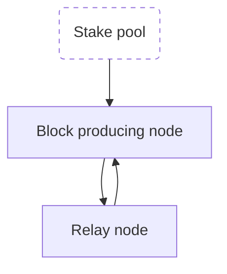

# Begin operating a Cardano Stake Pool

Midnight은 Cardano의 partner-chain으로, Cardano Stake Pool Operator(SPO)에게 Midnight의 탈중앙화와 보안을 지원할 수 있는 특별한 기회를 제공합니다. Midnight의 블록을 생성하려는 SPO는 Midnight partner-chain의 validator committee에 후보자로 등록해야 합니다.

Midnight validator가 되려면, 해당 역할이 지원되는 Cardano 환경에서 Cardano stake pool operator(SPO)이거나 SPO가 되어야 합니다.

## Supported environments

| Cardano env. | Status | Midnight env.
|----------|----------|----------|
| `preview` | ✅ | `testnet-02` |
| `preprod` | ❌ | N/A |
| `mainnet` | ❌ | N/A |

## Become a Cardano SPO

### Requirements

1. Cardano node 버전 [`10.1.4`](https://github.com/IntersectMBO/cardano-node/releases/tag/10.1.4). 이 버전을 사용하세요.
2. stake pool pledge를 위한 500 `tAda` + 수수료.
3. Midnight validator 등록 수수료를 위한 UTXO와 해당 `payment.skey`.
3. Midnight validator 등록 과정에서 SPO `cold.skey`도 필요합니다.
4. 비밀 키 저장을 위한 에어갭 장치(testnet에서는 선택 사항).

:::info

일반 Ed25519 키 또는 확장 Ed25519 키를 사용하세요.

:::

### Useful Cardano stake pool operation resources

- [Cardano Handbook](https://cardano-course.gitbook.io/cardano-course/handbook) - Cardano 노드 실행부터 stake pool 관리까지 모든 것을 다루는 종합 가이드입니다. **새로운 Stake Pool Operator(SPO)가 기초를 이해하는 데 강력히 추천합니다.**
- [Guild Operators SPO Toolkit](https://cardano-community.github.io/guild-operators/basics/) - Stake Pool Operator의 설정과 관리를 신속하게 진행할 수 있도록 만들어진 도구 모음입니다. **기술적 배경이 있고 장문의 문서 없이 바로 실습에 들어가고 싶은 분에게 적합합니다.**

---

-   [Preview testnet 설정 파일](https://book.world.dev.cardano.org/env-preview.html#configuration-files)
-   [tADA 요청용 Testnets faucet](https://docs.cardano.org/cardano-testnet/tools/faucet/)
