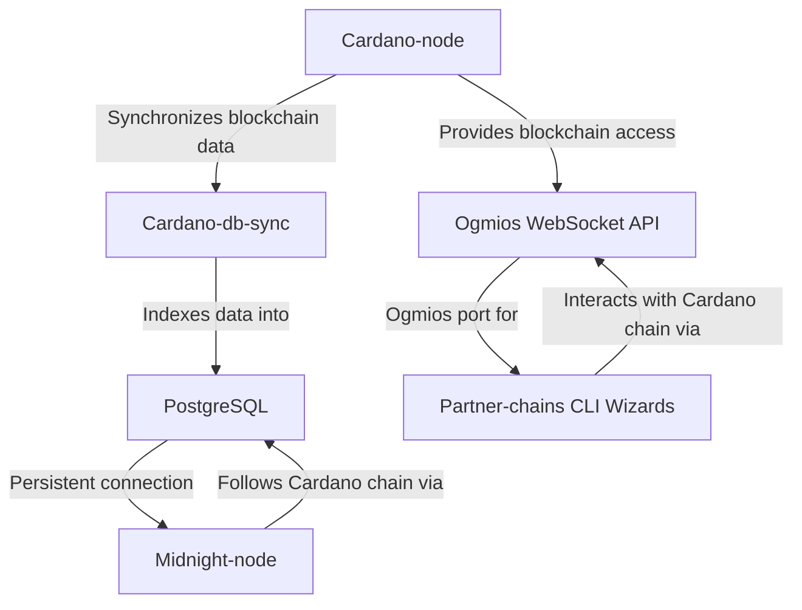

# Configure Partner-Chains Dependencies

이 가이드에서는 [Cardano-node](https://github.com/IntersectMBO/cardano-node), [Cardano-db-sync](https://github.com/IntersectMBO/cardano-db-sync), PostgreSQL, [Ogmios](https://ogmios.dev/) 등 partner-chain 의존성을 설정하는 방법을 설명합니다. 이 서비스들이 왜 필요한지 살펴보겠습니다.



- **Cardano-node**: Cardano 체인을 다운로드하고 동기화하는 기본 클라이언트입니다.
- **Cardano-db-sync** & **PostgresSQL**: Cardano-db-sync는 Cardano-node 데이터베이스를 Postgres 포트를 통해 접근 가능한 PostgreSQL 데이터베이스로 인덱싱합니다. Midnight-node는 Cardano 체인을 추적하기 위해 Postgres 포트에 대한 지속적인 연결이 필요합니다.
- **Ogmios**: Ogmios는 애플리케이션이 Cardano 체인과 상호작용할 수 있게 해주는 WebSocket API입니다. 등록 과정에서 사용할 partner-chains CLI wizard를 호출할 때 Ogmios 포트가 필요합니다.

제공되는 `compose-partner-chains.yml` 파일과 [Docker Compose](https://docs.docker.com/compose/)를 사용하면 이러한 서비스를 더 쉽게 실행할 수 있습니다.

## Prerequisites

시작하기 전에 다음 사항을 확인하세요:

- 시스템이 최소 서버 요구사항(#system-requirements)을 충족하는지 확인하세요.
- 서버에 대한 관리자 접근 권한이 있어야 합니다.
- Docker와 Docker Compose가 설치되어 있어야 합니다. 설치 방법은 [Install Docker Engine](https://docs.docker.com/engine/install/)과 [Install Docker Compose](https://docs.docker.com/compose/install/)를 참조하세요.
- **Docker가 [Rootless mode](https://docs.docker.com/engine/security/rootless/)로 실행되도록 설정하세요.**
- **`/etc/docker/daemon.json`을 편집하여 Docker가 UFW를 존중하도록 설정하세요**
   ```bash
   {
      "iptables": false
   }
   ```
   - Docker를 재시작하고 방화벽 규칙을 확인하세요:
   ```bash
   sudo systemctl restart docker
   sudo ufw status
   ```

:::note

보안을 위해 설정 후 반드시 방화벽 설정을 검증하세요.

:::


## Set up dependencies with Docker Compose

Docker Compose를 사용하여 partner-chain 의존성을 구성하고 시작하려면 다음 단계를 따르세요.

### Install direnv

환경 변수를 관리하기 위해 `direnv`를 설치하세요. 자세한 설치 방법은 [direnv Installation](https://direnv.net/docs/installation.html)을 참조하세요.

- `direnv` 설치:

```bash
sudo apt install direnv
```

설치 후, `direnv`를 셸 프로파일에 *hook*해야 합니다.

- `.bashrc`에 다음 줄을 추가하세요

```bash
eval "$(direnv hook bash)"
```

- 셸을 새로 고치세요

```shell
source ~/.bashrc
```

### Clone the `Midnight-node-docker` repository

`midnight-node-docker` 저장소를 클론하고 프로젝트 디렉토리로 이동하세요:

```bash
git clone git@github.com:midnightntwrk/midnight-node-docker.git
cd midnight-node-docker
```

디렉토리에 들어가면, `direnv`가 `.envrc` 파일 허용 여부를 묻습니다. 파일을 점검하여 안전한지 확인하세요:

```bash
cat .envrc
```

파일에 문제가 없으면 실행하세요:

```bash
direnv allow
```

이 명령은 디렉토리에 진입할 때 `direnv`가 자동으로 환경 변수를 설정하고, 떠날 때 해제하도록 합니다.

### Configure environment variables

(`.envrc`에 설정된 환경 변수는 변경할 필요가 없습니다. 이 섹션은 선택 사항입니다)

`Cardano-db-sync`용 `PostgreSQL` 설정을 구성하려면 `.envrc` 파일을 편집하세요:

- Visual Studio Code 또는 `vim` 같은 텍스트 편집기로 `.envrc` 파일을 여세요:

```shell
vim .envrc
```

- `vim`에서 `i`를 눌러 삽입 모드로 전환하세요.
- `POSTGRES_*` 변수를 찾아 업데이트하세요. 예:

:::note

PostgreSQL 비밀번호는 `.envrc` 파일과 같은 디렉토리에 있는 `postgres.password` 파일에 저장됩니다. 이 파일은 다음 단계에서 서비스를 시작할 때 자동으로 생성됩니다.

:::

- 저장하고 종료하세요:
   - `vim`에서 `Esc`를 누른 후 `:wq`를 입력하고 `Enter`를 누르세요.

이 설정은 `Cardano-db-sync`가 사용하는 데이터베이스를 구성하며, `midnight-node`가 읽게 됩니다.

### Start partner-chains dependency services

:::note Docker Desktop users
Docker Desktop은 그래픽 앱이지만 `docker compose` 같은 명령은 실행할 수 없습니다. Docker Desktop은 백그라운드 Docker 엔진만 제공합니다. 모든 Midnight 명령은 시스템 터미널에서 실행해야 합니다.

명령을 실행하기 전에:

1. **Docker Desktop**을 여세요  
2. **"Docker is running"**이 표시될 때까지 기다리세요  
3. Docker Desktop을 열어 둔 채로 두세요 - UI에서 컨테이너를 실행하지 마세요  
4. 이 가이드에 표시된 대로 모든 명령을 터미널에서 실행하세요  
:::


partner-chain 의존성을 분리(detached) 모드로 실행하세요:

```bash
docker compose -f compose-partner-chains.yml up -d
```

:::note
최신 문법인 `docker compose`(공백 포함)를 사용하세요.  
이전 Docker 설치 환경에서 이를 지원하지 않는 경우, 레거시 명령인 `docker-compose`를 사용하세요.
:::


출력 예시:

```bash
[+] Running 5/5
 ✔ Network midnight-node-docker_default  Created                                                                 0.0s 
 ✔ Container cardano-ogmios              Started                                                                 0.3s 
 ✔ Container db-sync-postgres            Healthy                                                                 5.8s 
 ✔ Container cardano-node                Started                                                                 0.3s 
 ✔ Container cardano-db-sync             Started                                                                 5.9s 
```

:::important

Cardano 네트워크와의 동기화는 몇 시간이 걸릴 수 있습니다. 진행하기 전에 모든 의존성이 완전히 동기화되었는지 확인하세요.

:::

<details>
<summary><b>Common Errors</b></summary>

1. **cardano-db-sync 로그에서 PostgreSQL 인증 실패 오류가 표시되는 경우 (postgres 사용자의 비밀번호가 잘못됨):**

```bash
cardano-db-sync: libpq: failed (connection to server at "postgres" (172.18.0.3), port 5432 failed: FATAL:  password authentication failed for user "postgres")
```
   - **원인**: 이전 실행에서 `postgres` 컨테이너가 다른 비밀번호로 초기화되었을 수 있으며, `postgres-data` 볼륨에 해당 설정이 남아 있을 수 있습니다. `postgres.password` 파일을 재생성하거나 `.envrc`의 비밀번호를 변경한 경우, `postgres` 서비스가 여전히 영구 볼륨에 저장된 이전 비밀번호를 사용하고 있을 수 있습니다.
   - **해결 방법**: PostgreSQL 데이터 볼륨을 삭제하세요:
   ```bash
   docker compose -f compose-partner-chains.yml down
   docker volume rm midnight-node-docker_postgres-data
   docker compose -f compose-partner-chains.yml up -d
   ```
   이렇게 하면 영구 PostgreSQL 데이터가 삭제되어, `postgres` 컨테이너가 현재 `POSTGRES_PASSWORD`로 재초기화됩니다.

</details>

### Manage and monitor services:

1. **서비스와 포트 상태 확인:**

   - 활성 Docker 컨테이너의 상태, 포트, 컨테이너 ID 목록을 확인하세요:

   ```bash
   docker container list
   ```

   출력 예시:

   ```shell
   CONTAINER ID   IMAGE                                           COMMAND                  CREATED         STATUS                   PORTS                                       NAMES
   aeddf39b71f7   ghcr.io/intersectmbo/cardano-db-sync:13.5.0.2   "/nix/store/mvypj83y…"   9 minutes ago   Up 9 minutes                                                         db-sync
   61a6eb0ed321   cardanosolutions/ogmios:v6.5.0                  "/bin/ogmios --node-…"   9 minutes ago   Up 9 minutes (healthy)   0.0.0.0:1337->1337/tcp, :::1337->1337/tcp   ogmios
   b514a818da45   postgres:15.3                                   "docker-entrypoint.s…"   9 minutes ago   Up 9 minutes (healthy)   0.0.0.0:5432->5432/tcp, :::5432->5432/tcp   db-sync-postgres
   558d2b49eddc   ghcr.io/intersectmbo/cardano-node:10.1.2        "entrypoint"             9 minutes ago   Up 9 minutes             0.0.0.0:3001->3001/tcp, :::3001->3001/tcp   cardano-node
   ```

2. **특정 컨테이너 로그 확인:**

특정 컨테이너의 로그를 확인하려면 `docker logs <컨테이너 이름 또는 컨테이너 ID>`를 사용하세요:

```bash
docker logs cardano-ogmios
docker logs cardano-db-sync
docker logs db-sync-postgres
docker logs cardano-node
```

3. **유용한 docker-compose 명령:**

   Docker Compose에 대해 더 알아보려면 공식 [Docker Compose 문서](https://docs.docker.com/compose/)를 방문하세요. 자주 사용하는 명령은 다음과 같습니다:

   ```shell
   docker-compose stop # 컨테이너 중지
   docker-compose start # 컨테이너 시작
   docker-compose restart # 컨테이너 재시작
   docker-compose down # 컨테이너 중지 및 삭제
   docker-compose stats # 리소스 사용 통계 표시
   ```

4. **Ogmios 서비스 모니터링:**

   - http://localhost:1337/에서 Ogmios 대시보드를 확인하세요. Ogmios가 원격 서버에서 실행 중이라면 해당 IP 주소와 PORT를 사용하여 브라우저에서 http://x.x.x.x:1337에 접속하세요.
   - Ogmios 헬스체크를 조회하세요:
   ```
   curl -s localhost:1337/health | jq '.'
   ```

5. **Cardano-db-sync 동기화 진행률 조회:**

   - **`psql`로 직접 조회:**

     PostgreSQL 클라이언트가 아직 설치되지 않았다면 다음 명령으로 설치하세요:

     ```shell
     sudo apt-get install postgresql-client
     ```

     `psql`로 PostgreSQL 셸에 접속하세요: 
     
     ```shell
      psql -h localhost -U postgres -d cexplorer -p 5432
      ```
     
      또는 `docker`로 PostgreSQL 셸에 접속하세요: 

     ```shell
     docker exec -it db-sync-postgres psql -U postgres -d cexplorer
     ```

     PostgreSQL 셸에서 다음 쿼리를 실행하세요:

     ```sql
     SELECT 100 * (
         EXTRACT(EPOCH FROM (MAX(time) AT TIME ZONE 'UTC')) -
         EXTRACT(EPOCH FROM (MIN(time) AT TIME ZONE 'UTC'))
     ) / (
         EXTRACT(EPOCH FROM (NOW() AT TIME ZONE 'UTC')) -
         EXTRACT(EPOCH FROM (MIN(time) AT TIME ZONE 'UTC'))
     ) AS sync_percent
     FROM block;
     ```

   - **`ssh`로 원격 조회:**

     원격으로 조회하려면 SSH를 통해 다음 명령을 실행하세요:
     
     ```shell
     ssh user@x.x.x.x -C "psql -d cexplorer -h localhost -p 5432 -U postgres -c \"SELECT 100 * (EXTRACT(EPOCH FROM (MAX(time) AT TIME ZONE 'UTC')) - EXTRACT(EPOCH FROM (MIN(time) AT TIME ZONE 'UTC'))) / (EXTRACT(EPOCH FROM (NOW() AT TIME ZONE 'UTC')) - EXTRACT(EPOCH FROM (MIN(time) AT TIME ZONE 'UTC'))) AS sync_percent FROM block;\""
     ```

     `user@x.x.x.x`를 SSH 사용자명과 서버 IP 주소로 대체하세요.
