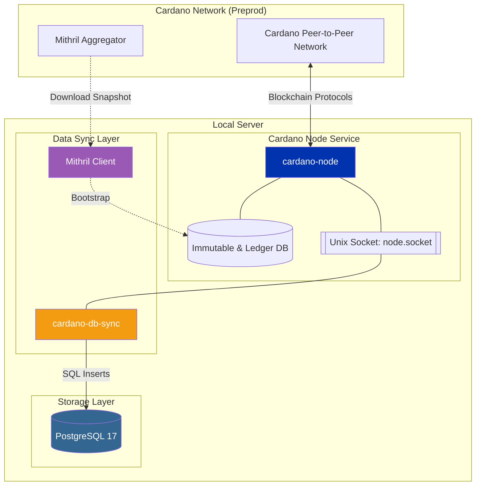

import Tabs from '@theme/Tabs';
import TabItem from '@theme/TabItem';

# Set up Cardano node

Midnight은 Cardano의 partner chain으로 동작하며, 상호운용성과 보안 공유를 제공합니다. Midnight 노드가 Cardano 블록체인과 동기화를 유지하려면, Cardano-db-sync가 채워 넣는 PostgreSQL 데이터베이스에 지속적으로 연결되어 있어야 합니다. 이 데이터베이스는 Cardano의 on-chain 데이터를 색인하여 쿼리 가능한 형태로 제공합니다.

이 가이드는 Cardano relay 노드와, cardano-db-sync로 동기화되는 PostgreSQL 데이터베이스를 설정하는 단계별 방법을 안내합니다.

:::note Supported platform

이 노드 설정 가이드는 **x86-64(amd64) 환경의 Linux**를 대상으로 합니다. 명령어와 바이너리 다운로드 URL은 이 아키텍처를 전제로 합니다. 다른 플랫폼용 빌드가 있을 수 있지만, 멀티 아키텍처 설명은 이 문서의 범위를 벗어납니다.

:::

## Prerequisites

모든 노드를 정상적으로 실행하려면 다음 조건을 갖춰야 합니다.

<details>
<summary>System requirements</summary>

Linux 운영체제는 GLIBC 2.39 이상과 호환되어야 합니다. 다음 중 하나를 사용하세요.

* Ubuntu 24.04 이상
* Debian 13 이상

GLIBC 버전은 다음 명령으로 확인하세요. `ldd --version`

</details>

<details>
<summary>Hardware requirements</summary>

| Requirement          | Cardano Mainnet                                                                                      | Preview/Preprod Testnet                                          |
| -------------------- | -------------------------------------------------------------------------------------------------------- | -------------------------------------------------------------------- |
| **Operating system** | 64비트 Linux (Ubuntu 24.04 LTS 권장)                                                              | 64비트 Linux (Ubuntu 24.04 LTS 권장)                          |
| **Memory**           | 32 GB 이상                                                                                            | 16 GB 이상                                                        |
| **CPU cores**        | 4코어 이상                                                                                                | 4코어 이상                                                            |
| **IOPS**             | 60,000 IOPS 이상. 이보다 낮으면 sync 시간이 길어지거나 chain tip을 따라가지 못할 수 있습니다. | 30,000 IOPS 이상. 이보다 낮으면 sync 시간이 길어집니다. |
| **Disk storage**     | 320 GB NVMe SSD                                                                                          | 40 GB NVMe SSD (최소)                                             |
| **Network**          | 안정적인 100 Mbps 이상                                                                                | 안정적인 100 Mbps 이상                                            |
</details>

<details>
<summary>User segregation</summary>

노드 서비스를 실행할 비특권 사용자를 선택적으로 만들 수 있습니다. 블록체인 노드를 root로 실행하지 않는 것이 보안 모범 사례입니다.

노드 서비스를 실행할 "midnight"이라는 비특권 사용자를 만드세요.

```bash
sudo adduser midnight
```

사용자에게 sudo 권한을 부여하세요.

```bash
sudo usermod -aG sudo midnight
```

"midnight" 사용자로 전환하세요.

```bash
su - midnight
```

프로필을 확인하세요.

```bash
whoami # "midnight"이 반환되어야 합니다
```

</details>

## Mithril setup

이 가이드는 [Mithril](https://mithril.network/)을 사용해 검증된 Cardano 블록체인 snapshot을 내려받습니다. 이를 통해 sync 시간을 며칠에서 약 20분으로 단축할 수 있습니다.



### Install Mithril tooling

임시 디렉터리를 만들고 그 위치로 이동하세요.

```bash
mkdir -p $HOME/tmp/mithril && cd $HOME/tmp/mithril
```

Mithril signer, client, aggregator(pre-release)를 설치하세요.

```bash
curl --proto '=https' --tlsv1.2 -sSf https://raw.githubusercontent.com/input-output-hk/mithril/refs/heads/main/mithril-install.sh | sh -s -- -c mithril-signer -d unstable -p $(pwd)
curl --proto '=https' --tlsv1.2 -sSf https://raw.githubusercontent.com/input-output-hk/mithril/refs/heads/main/mithril-install.sh | sh -s -- -c mithril-client -d unstable -p $(pwd)
curl --proto '=https' --tlsv1.2 -sSf https://raw.githubusercontent.com/input-output-hk/mithril/refs/heads/main/mithril-install.sh | sh -s -- -c mithril-aggregator -d unstable -p $(pwd)
```

### Configure Cardano environment variables (for Mithril)

:::info
최신 Mithril 네트워크 구성은 [https://mithril.network/doc/manual/getting-started/network-configurations](https://mithril.network/doc/manual/getting-started/network-configurations)를 참조하세요.
:::

사용 중인 Cardano 네트워크를 가리키도록 다음 변수를 설정하세요.

<Tabs>
<TabItem value="preview" label="Preview">

```bash
export CARDANO_NETWORK=preview
export AGGREGATOR_ENDPOINT=https://aggregator.pre-release-preview.api.mithril.network/aggregator
export GENESIS_VERIFICATION_KEY=$(wget -q -O - https://raw.githubusercontent.com/input-output-hk/mithril/main/mithril-infra/configuration/pre-release-preview/genesis.vkey)
export ANCILLARY_VERIFICATION_KEY=$(wget -q -O - https://raw.githubusercontent.com/input-output-hk/mithril/main/mithril-infra/configuration/pre-release-preview/ancillary.vkey)
export SNAPSHOT_DIGEST=latest
```

</TabItem>
<TabItem value="preprod" label="Preprod">

```bash
export CARDANO_NETWORK=preprod
export AGGREGATOR_ENDPOINT=https://aggregator.release-preprod.api.mithril.network/aggregator
export GENESIS_VERIFICATION_KEY=$(wget -q -O - https://raw.githubusercontent.com/input-output-hk/mithril/main/mithril-infra/configuration/release-preprod/genesis.vkey)
export ANCILLARY_VERIFICATION_KEY=$(wget -q -O - https://raw.githubusercontent.com/input-output-hk/mithril/main/mithril-infra/configuration/release-preprod/ancillary.vkey)
export SNAPSHOT_DIGEST=latest
```

</TabItem>
<TabItem value="mainnet" label="Mainnet">

```bash
export CARDANO_NETWORK=mainnet
export AGGREGATOR_ENDPOINT=https://aggregator.release-mainnet.api.mithril.network/aggregator
export GENESIS_VERIFICATION_KEY=$(wget -q -O - https://raw.githubusercontent.com/input-output-hk/mithril/main/mithril-infra/configuration/release-mainnet/genesis.vkey)
export ANCILLARY_VERIFICATION_KEY=$(wget -q -O - https://raw.githubusercontent.com/input-output-hk/mithril/main/mithril-infra/configuration/release-mainnet/ancillary.vkey)
export SNAPSHOT_DIGEST=latest
```

:::warning
Cardano mainnet 데이터베이스는 testnet 데이터베이스보다 훨씬 큽니다. 따라서 mainnet snapshot 다운로드에는 시간이 더 오래 걸립니다.
:::

</TabItem>
</Tabs>

### Download Cardano database snapshot

최신 snapshot을 조회하고 확인하세요.

```bash
./mithril-client cardano-db snapshot list
./mithril-client cardano-db snapshot show $SNAPSHOT_DIGEST
```

데이터베이스를 다운로드하고 검증하세요.

```bash
./mithril-client cardano-db download --include-ancillary $SNAPSHOT_DIGEST
```

Mithril client는 작업 디렉터리 안의 `db/` 디렉터리로 snapshot을 내려받으며, 여기서는 `/tmp/mithril/db`입니다. 이 데이터베이스는 Cardano 노드를 bootstrap하는 데 사용됩니다.

## Setup Cardano relay node

Cardano node는 Cardano의 공식 클라이언트입니다. 노드를 설치하는 방법은 여러 가지가 있으며, 이 가이드는 공식 사전 컴파일 바이너리 릴리스를 사용합니다.

:::note
소스에서 직접 빌드하거나 다른 방법을 살펴보려면 [Cardano 공식 문서](https://developers.cardano.org/docs/operate-a-stake-pool/relay-configuration/relay-node-configuration/)를 참조하세요.
:::

### Download Cardano node pre-compiled binary

다음 명령을 실행해 Cardano node 사전 컴파일 바이너리를 `~/.local/bin`에 설치하세요.

최신 릴리스는 항상 GitHub의 공식 [Cardano node 릴리스 페이지](https://github.com/IntersectMBO/cardano-node/releases)에서 확인하세요.

```bash
VERSION="11.0.1"
ARCH="linux-amd64"
URL="https://github.com/IntersectMBO/cardano-node/releases/download/${VERSION}/cardano-node-${VERSION}-${ARCH}.tar.gz"
```

다음 명령을 실행해 대상 디렉터리가 있는지 확인하세요.

```bash
mkdir -p ~/.local/bin
mkdir -p ~/.local/share
```

다음 명령을 실행해 알맞은 위치로 바로 다운로드하고 압축을 푸세요.

```bash
# --strip-components=1은 최상위 'bin/' 또는 'share/' 래퍼를 제거합니다
curl -L "$URL" | tar -xz -C ~/.local/bin --strip-components=2 ./bin
curl -L "$URL" | tar -xz -C ~/.local/share --strip-components=1 ./share
```

다음 명령을 실행해 실행 권한이 있는지 확인하세요.

```bash
chmod +x ~/.local/bin/cardano-*
```

이렇게 하면 바이너리(`~/.local/bin`)와 각 Cardano 네트워크용 Cardano node 설정 파일(`~/.local/share/<network>`)을 내려받아 압축을 풉니다.

다음 명령을 실행해 바이너리와 설정 파일이 있는지 확인하세요.

```bash
ls ~/.local/bin ~/.local/share
```

출력 예시:

```bash
~/.local/bin:
bech32       cardano-node        cardano-testnet  db-analyser     db-truncater        tx-generator
cardano-cli  cardano-submit-api  cardano-tracer   db-synthesizer  snapshot-converter

~/.local/share:
mainnet  preprod  preview
```

셸 세션을 새로 고친 뒤 Cardano node 바이너리를 실행할 수 있는지 확인하세요.

```bash
source ~/.bashrc # or ~/.zshrc
which cardano-node
# /$HOME/$USER/.local/bin/cardano-node
cardano-node --version
# cardano-node 11.0.1 - linux-x86_64 - ghc-9.6
# git rev 6c034ec038d8d276a3595e10e2d38643f09bd1f2
```

### Inject Mithril snapshot (optional)

이 단계에서 원하는 데이터 저장 방식을 정할 수 있습니다. 이 가이드에서는 Cardano 노드의 데이터베이스와 노드 socket 경로로 사용할 `~/cardano-data` 디렉터리를 만듭니다.

```bash
mkdir ~/cardano-data
```

Cardano 데이터베이스 snapshot을 옮기세요.

```bash
mv ~/tmp/mithril/db/ ~/cardano-data/
```

데이터베이스가 옮겨졌는지 확인하세요.

```bash
ls ~/cardano-data/db
```

### Run Cardano node

`cardano-node`를 시작할 때는 `~/.local/bin/share/<network: preprod, mainnet, preview>`의 설정 파일 경로와 데이터베이스 경로를 함께 지정합니다. Mithril client는 이미 *Cardano Preprod* 데이터베이스 snapshot을 `~/cardano-preprod/db`에 내려받아 둔 상태입니다.

셸에서 노드를 대화형으로 시작하세요.

<Tabs>
<TabItem value="preview" label="Preview">

```bash
cardano-node run \
--topology ~/.local/share/preview/topology.json \
--database-path ~/cardano-data/db \
--socket-path ~/cardano-data/db/node.socket \
--host-addr 0.0.0.0 \
--port 3001 \
--config ~/.local/share/preview/config.json
```

</TabItem>
<TabItem value="preprod" label="Preprod">

```bash
cardano-node run \
--topology ~/.local/share/preprod/topology.json \
--database-path ~/cardano-data/db \
--socket-path ~/cardano-data/db/node.socket \
--host-addr 0.0.0.0 \
--port 3001 \
--config ~/.local/share/preprod/config.json
```

</TabItem>
<TabItem value="mainnet" label="Mainnet">

```bash
cardano-node run \
--topology ~/.local/share/mainnet/topology.json \
--database-path ~/cardano-data/db \
--socket-path ~/cardano-data/db/node.socket \
--host-addr 0.0.0.0 \
--port 3001 \
--config ~/.local/share/mainnet/config.json
```
</TabItem>
</Tabs>

Mainnet 데이터베이스 snapshot을 사용한 경우, 노드가 내부 초기화를 마치기 전까지는 `node.socket` 파일이 생성되지 *않습니다*. 이 과정에는 데이터베이스 검증과 필요한 블록의 replay가 포함됩니다. 따라서 잠시 기다려야 합니다.

아래 로그 예시는 Cardano 노드가 chain의 1.76%만 replay한 상태를 보여줍니다. 완료까지 약 20분이 걸릴 수 있습니다.

```bash
Mar 10 21:36:58 mnf-mainnet-validator-1 cardano-node[7201]: [mnf-main:cardano.node.ChainDB:Info:5] [2026-03-10 21:36:58.11 UTC] Replayed block: slot 3196799 out of 181548256. Progress: 1.76%
```

`cardano-node`의 최신 블록 높이를 확인하세요.

```bash
export CARDANO_NODE_SOCKET_PATH="$HOME/cardano-data/db/node.socket"

# Cardano testnet에서는 --testnet-magic 1(preprod) 또는 2(preview)를 사용해야 합니다
cardano-cli query tip --testnet-magic 1

# mainnet을 조회하려면 다음처럼 --mainnet을 전달하세요
# cardano-cli query tip --mainnet
```

출력 예시:

```bash
{
    "block": 136111,
    "epoch": 10,
    "era": "Alonzo",
    "hash": "dc7767c3e2d116f3be63b33033a223fc5429a2ad65ade92578d1c40795a5f5b1",
    "slot": 2815017,
    "slotInEpoch": 136617,
    "slotsToEpochEnd": 295383,
    "syncProgress": "3.91"
}
```

`cardano-cli query tip`를 실행하면 로컬 노드에 블록체인에 대한 "현재 시점의 상태"를 묻는 것입니다. 노드가 아직 sync 중이므로, 이 출력은 네트워크 전체 기록에서 노드가 현재 어느 지점에 있는지를 나타냅니다.

- **`"block"`**: 노드가 마지막으로 처리한 블록의 높이입니다. 여기서는 블록 *136,111*에 도달했습니다.
- **`"epoch"`**: 노드가 현재 보고 있는 epoch입니다. epoch는 일정한 기간으로, Mainnet에서는 5일에 해당하지만 testnet에서는 다릅니다. 노드는 현재 *Epoch 10*에 있습니다.
- **`"era"`**: 노드가 현재 처리 중인 프로토콜 버전(hard fork)입니다. *"Alonzo"*가 표시된다면, 스마트 컨트랙트를 도입한 시대의 기록을 replay하고 있다는 뜻입니다. sync가 더 진행되면 이 값이 *"Babbage"*로, 이후 현재 시대인 *"Conway"*로 바뀝니다.
- **`"hash"`**: 노드가 처리한 가장 최근 블록의 고유한 디지털 지문입니다.
- **`"slot"`**: 네트워크가 시작된 시점("Genesis") 이후 지나간 총 초/slot 수입니다.
- **`"slotInEpoch"`** & **`"slotsToEpochEnd"`**: 현재 epoch에서 얼마나 진행되었는지를 나타냅니다. 노드는 Epoch 10에서 136,617 slot을 완료했으며, Epoch 11이 시작되기까지 295,383 slot이 남아 있습니다.
- **`"syncProgress"`**: *가장 중요한 값입니다.* 노드가 블록체인의 *3.91%*만 다운로드하고 검증했음을 보여줍니다.

### Create Cardano node `systemd` service files

relay 노드용 서비스 파일을 만드세요.

```bash
sudo vim /etc/systemd/system/cardano-node.service
```

서비스 파일에 다음 내용을 붙여 넣으세요.

<Tabs>
<TabItem value="preview" label="Preview">

```bash
[Unit]
Description=Cardano Relay Node
Wants=network-online.target
After=network-online.target

[Service]
User=midnight
Type=simple
WorkingDirectory=/home/midnight/cardano-data
ExecStart=/home/midnight/.local/bin/cardano-node run \
    --topology /home/midnight/.local/share/preview/topology.json \
    --database-path /home/midnight/cardano-data/db \
    --socket-path /home/midnight/cardano-data/db/node.socket \
    --host-addr 0.0.0.0 \
    --port 3001 \
    --config /home/midnight/.local/share/preview/config.json
KillSignal=SIGINT
Restart=always
RestartSec=5
LimitNOFILE=32768

[Install]
WantedBy=multi-user.target
```
</TabItem>
<TabItem value="preprod" label="Preprod">

```bash
[Unit]
Description=Cardano Relay Node
Wants=network-online.target
After=network-online.target

[Service]
User=midnight
Type=simple
WorkingDirectory=/home/midnight/cardano-data
ExecStart=/home/midnight/.local/bin/cardano-node run \
    --topology /home/midnight/.local/share/preprod/topology.json \
    --database-path /home/midnight/cardano-data/db \
    --socket-path /home/midnight/cardano-data/db/node.socket \
    --host-addr 0.0.0.0 \
    --port 3001 \
    --config /home/midnight/.local/share/preprod/config.json
KillSignal=SIGINT
Restart=always
RestartSec=5
LimitNOFILE=32768

[Install]
WantedBy=multi-user.target
```
</TabItem>
<TabItem value="mainnet" label="Mainnet">

```bash
[Unit]
Description=Cardano Mainnet Node
Wants=network-online.target
After=network-online.target

[Service]
User=midnight
Type=simple
# 이 디렉터리가 있는지 확인하거나, 프로세스를 실행할 위치로 경로를 변경하세요
WorkingDirectory=/home/midnight/cardano-data
ExecStart=/home/midnight/.local/bin/cardano-node run \
    --topology /home/midnight/.local/share/mainnet/topology.json \
    --database-path /home/midnight/cardano-data/db \
    --socket-path /home/midnight/cardano-data/db/node.socket \
    --host-addr 0.0.0.0 \
    --port 3001 \
    --config /home/midnight/.local/share/mainnet/config.json
KillSignal=SIGINT
Restart=always
RestartSec=5
LimitNOFILE=32768

[Install]
WantedBy=multi-user.target
```
</TabItem>
</Tabs>

새 파일을 인식하도록 `systemd`를 다시 로드하세요.

```bash
sudo systemctl daemon-reload
```

부팅 시 서비스가 시작되도록 활성화하세요.

```bash
sudo systemctl enable cardano-node
```

Cardano node 서비스를 시작하고 상태를 확인하세요.

```bash
sudo systemctl start cardano-node
sudo systemctl status cardano-node
```

로그를 실시간으로 확인하세요.

```bash
journalctl -fu cardano-node
```

## Next steps

Cardano relay 노드가 실행되면, 이어서 [PostgreSQL 데이터베이스와 Cardano-db-sync를 설정](./cardano-db-sync)하세요.