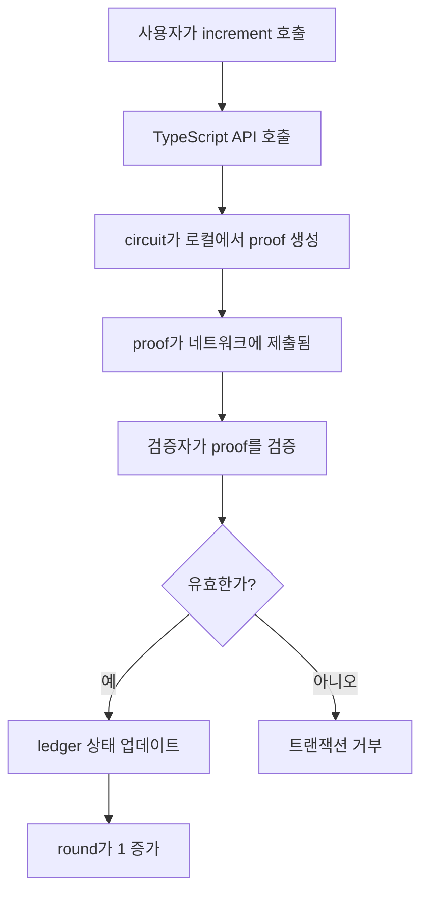

# Counter contract

이 튜토리얼에서는 Midnight 블록체인에서 카운터 값을 관리하는 스마트 컨트랙트를 구축합니다.
이 컨트랙트는 ledger 상태 관리, circuit 정의 및 ZK proof 생성을 포함한 Compact 프로그래밍의 기본 개념을 다룹니다.

이 튜토리얼을 완료하면 다음을 할 수 있습니다:

- 공개 ledger 상태가 있는 Compact 스마트 컨트랙트 생성
- 온체인 상태를 변경하는 circuit 정의
- 컨트랙트를 ZK circuit로 컴파일
- 생성된 TypeScript API 이해
- 컨트랙트 상호작용을 위한 witness 함수 구현

Counter 컨트랙트는 핵심 개념에 집중하기 위해 의도적으로 최소화되었습니다. ZK proof 기반 트랜잭션을 통해 증가시킬 수 있는 단일 공개 카운터 값을 유지합니다.

## Prerequisites

시작하기 전에 다음 사항을 확인하세요:

- **Compact 툴체인 설치**: 설치 방법은 [툴체인 설치](../../../getting-started/installation) 가이드를 참조하세요
- **proof 서버 실행 중**: 설치 방법은 [proof 서버 실행](../../../getting-started/installation/#run-the-proof-server) 가이드를 참조하세요
- **Node.js 버전 22 이상**: `node --version`으로 확인하세요

## Project structure

Counter 프로젝트는 스마트 컨트랙트를 애플리케이션 로직과 분리하는 모듈식 구조를 사용합니다:

```
example-counter/
├── contract/                    # 스마트 컨트랙트 서브 프로젝트
│   ├── src/
│   │   ├── counter.compact     # Compact 스마트 컨트랙트
│   │   ├── witnesses.ts        # Witness 구현
│   │   ├── index.ts            # 컨트랙트 API 재내보내기
│   │   └── test/               # 컨트랙트 단위 테스트
│   ├── managed/                # 컴파일러 생성 코드 (빌드 시 생성)
│   └── package.json            # 컨트랙트 의존성
└── counter-cli/                # CLI 애플리케이션 (파트 2)
    ├── src/
    └── package.json
```

이 구조 덕분에 다음이 가능합니다:

- 사용자 인터페이스와 독립적으로 컨트랙트 로직을 테스트할 수 있습니다.
- 여러 애플리케이션(CLI, 웹, 모바일)에서 컨트랙트를 재사용할 수 있습니다.
- 애플리케이션 코드를 수정하지 않고도 컨트랙트를 업데이트할 수 있습니다.
- 개발 팀 간에 컨트랙트 코드를 공유할 수 있습니다.

## Set up the project

이 섹션에서는 프로젝트를 설정하고 컨트랙트 파일을 생성하는 과정을 설명합니다.

### Create the directory structure

프로젝트 루트와 컨트랙트 디렉터리를 생성합니다.

```bash
mkdir -p example-counter/contract/src
cd example-counter/contract
```

디렉터리 구조는 다음과 같아야 합니다:

```
example-counter/
└── contract/
    └── src/
```

### Initialize the npm package

`contract` 디렉터리에 `package.json` 파일을 생성합니다:

```bash
npm init -y
```

기본값이 포함된 기본 `package.json` 파일이 생성됩니다.

### Configure TypeScript

`contract` 디렉터리에 `tsconfig.json` 파일을 생성합니다:

```json
{
  "include": ["src/**/*.ts"],
  "compilerOptions": {
    "rootDir": "src",
    "outDir": "dist",
    "declaration": true,
    "lib": ["ESNext"],
    "target": "ES2022",
    "module": "ESNext",
    "moduleResolution": "node",
    "allowJs": true,
    "forceConsistentCasingInFileNames": true,
    "noImplicitAny": true,
    "strict": true,
    "isolatedModules": true,
    "sourceMap": true,
    "resolveJsonModule": true,
    "esModuleInterop": true,
    "skipLibCheck": true
  }
}
```

주요 설정 옵션은 다음과 같습니다:

- `target`과 `module`: 최신 JavaScript 기능을 위해 ES2022로 설정
- `declaration`: TypeScript 소비자를 위한 `.d.ts` 타입 정의 파일을 생성
- `outDir`: 컴파일된 JavaScript 파일은 `./dist`에 저장
- `rootDir`: 소스 TypeScript 파일은 `./src`에 위치
- `strict`: 더 나은 코드 품질을 위한 엄격한 타입 검사 활성화

## Write the smart contract

이 섹션에서는 스마트 컨트랙트를 작성하는 과정과 핵심 개념을 설명합니다.

### Create the contract file

`contract/src/counter.compact`를 생성합니다:

```bash
touch src/counter.compact
```

코드 에디터에서 이 파일을 엽니다.

### Add the language version

`pragma language_version` 지시문은 컨트랙트에서 사용하는 Compact 버전을 지정합니다:

```compact
pragma language_version >= 0.22;
```

이 지시문은:

- 컨트랙트를 특정 Compact 버전에 고정합니다
- 향후 컴파일러 버전의 호환성 문제를 방지합니다
- 개발 환경 간 일관된 컴파일을 보장합니다

### Import the standard library

내장 타입과 함수를 위해 Compact의 표준 라이브러리를 임포트합니다:

```compact
pragma language_version >= 0.22;

import CompactStandardLibrary;
```

`CompactStandardLibrary`는 카운터 값을 증가 및 감소시키는 데 사용되는 `Counter` 타입과 같은 내장 타입 및 함수를 제공합니다.

### Define the ledger state

ledger는 컨트랙트의 공개 온체인 상태를 나타냅니다.

ledger 선언을 추가합니다:

```compact
pragma language_version >= 0.22;

import CompactStandardLibrary;

// 공개 상태
export ledger round: Counter;
```

이 선언은 블록체인에 공개 카운터를 생성합니다:

- `export`는 ledger 상태를 TypeScript API 및 컨트랙트의 JavaScript 구현에서 접근 가능하게 합니다.
- `ledger`는 모든 네트워크 참여자가 읽을 수 있는 온체인 공개 상태 변수로 선언합니다.
- `round`는 카운터 변수의 이름입니다.
- `Counter`는 `CompactStandardLibrary`의 타입으로, 0으로 초기화되며 increment/decrement 메서드를 제공합니다.

### Create the increment circuit

circuit는 스마트 컨트랙트의 진입점입니다. 상태를 변경하는 로직을 정의하고 ZK proof를 생성합니다.

`increment` circuit 정의를 추가합니다:

```compact
pragma language_version >= 0.22;

import CompactStandardLibrary;

// 공개 상태
export ledger round: Counter;

// 공개 상태를 변경하는 transition function
export circuit increment(): [] {
  round.increment(1);
}
```

이 circuit는 컨트랙트의 유일한 연산을 정의합니다:

- `export circuit`는 TypeScript API 및 JavaScript 구현을 위한 호출 가능한 진입점으로 표시합니다.
- `increment()`는 빈 매개변수 목록을 가진 circuit 이름으로, 이 연산은 입력이 필요하지 않습니다.
- `: []`는 반환 타입을 빈 튜플로 지정하여 반환 값이 없음을 나타냅니다.
- `round.increment(1)`는 `Counter` 타입의 내장 `increment` 메서드를 호출하여 카운터를 1 증가시킵니다.

완성된 counter 컨트랙트는 다음과 같아야 합니다:

```compact
pragma language_version >= 0.22;

import CompactStandardLibrary;

// 공개 상태
export ledger round: Counter;

// 공개 상태를 변경하는 transition function
export circuit increment(): [] {
  round.increment(1);
}
```

## Compile the contract

컴파일은 Compact 코드를 ZK circuit로 변환하고 컨트랙트와 상호작용하기 위한 TypeScript API를 생성합니다.

### Run the compiler

`contract` 디렉터리에서 컨트랙트를 컴파일합니다:

```bash
compact compile src/counter.compact src/managed/counter
```

이 명령은 세 부분으로 구성됩니다:

- `compact compile`은 Compact 컴파일러를 호출합니다.
- `src/counter.compact`는 컴파일할 소스 파일을 지정합니다.
- `src/managed/counter`는 생성된 파일의 출력 디렉터리를 지정합니다.

다음과 유사한 출력이 표시됩니다:

```
Compiling 1 circuits:
  circuit "increment" (k=5, rows=24)
Overall progress [====================] 1/1
```

컴파일러는 다음 단계를 수행합니다:

1. Compact 코드를 파싱하고 구문을 검증합니다.
2. 로직에서 ZK circuit를 생성합니다.
3. 각 circuit에 대한 proving 키와 verifying 키를 생성합니다.
4. TypeScript API 및 타입 정의를 생성합니다.

### Examine the generated files

컴파일 후, `src/managed/counter` 디렉터리에는 다음이 포함됩니다:

```
src/managed/counter/
├── contract/
│   ├── index.d.ts            # 타입 정의
│   ├── index.js              # JavaScript 구현
│   └── index.js.map
├── keys/                     # 암호학적 키
│   ├── increment.prover
│   ├── increment.verifier
├── zkir/                     # ZK 중간 표현
│   ├── increment.zkir
│   └── increment.bzkir
└── compiler/                 # 컴파일러 메타데이터
    └── contract-info.json
```

각 디렉터리는 다음과 같은 용도로 사용됩니다:

- `contract/`: DApp이 컨트랙트와 상호작용하는 데 사용하는 생성된 TypeScript API 및 JavaScript 구현을 포함합니다
- `keys/`: ZK proof 생성 및 검증에 사용되는 암호학적 키
- `zkir/`: proof 서버가 사용하는 중간 circuit 표현
- `compiler/`: circuit, 타입 및 구조에 대한 메타데이터 (JSON 형식)

## Understand the generated API

Compact 컴파일러는 컨트랙트 코드에 대응하는 TypeScript 정의를 생성합니다. `managed/counter/contract/index.d.ts`를 열어 생성된 타입을 확인하세요.

### Circuit types

`Circuits` 타입은 호출 가능한 함수를 정의합니다:

```typescript
export type Circuits<PS> = {
  increment(context: __compactRuntime.CircuitContext<PS>): __compactRuntime.CircuitResults<PS, []>;
}
```

이 타입은 다음을 정의합니다:

- `increment()` 메서드는 Compact 컨트랙트에서 정의한 circuit에 대응합니다.
- 각 circuit 메서드는 ZK proof와 circuit 출력을 포함하는 `CircuitResults` 타입을 반환합니다.
- 이 타입은 private 상태 타입을 나타내기 위해 `PS` 매개변수를 사용합니다.

### Ledger types

`Ledger` 타입은 공개 상태 구조를 정의합니다:

```typescript
export type Ledger = {
  round: bigint;
}
```

이 타입은 다음을 정의합니다:

- `round` 필드는 Compact 컨트랙트에서 선언한 ledger 상태에 대응합니다.
- JavaScript에서 Counter 값을 나타내기 위해 `bigint` 타입을 사용합니다.
- ledger 상태는 TypeScript에서 읽기 전용이며, 모든 수정은 circuit 호출을 통해서만 이루어져야 합니다.

### Witness types

`Witnesses` 타입은 private 상태 타입을 정의합니다:

```typescript
export type Witnesses<PS> = {
  // 비어 있음 - 이 컨트랙트에는 witness가 없습니다
}
```

Counter 컨트랙트는 private 상태나 witness 함수를 정의하지 않으므로 이 타입은 비어 있습니다. 더 복잡한 컨트랙트에서는 비어 있지 않은 witness 타입을 볼 수 있습니다.

### Contract type

`Contract` 클래스는 모든 것을 하나로 묶습니다:

```typescript
export declare class Contract<PS = any, W extends Witnesses<PS> = Witnesses<PS>> {
  witnesses: W;
  circuits: Circuits<PS>;
  impureCircuits: ImpureCircuits<PS>;
  constructor(witnesses: W);
  initialState(context: __compactRuntime.ConstructorContext<PS>): __compactRuntime.ConstructorResult<PS>;
}
```

`Contract` 클래스는 컴파일된 컨트랙트와 상호작용하기 위한 메인 인터페이스를 제공합니다:

- 두 개의 타입 매개변수를 사용합니다: private 상태 타입을 위한 `PS`와 witness 타입을 위한 `W`.
- `circuits` 필드는 외부 상태를 수정하지 않는 순수 circuit 함수에 대한 접근을 제공합니다.
- `impureCircuits` 필드는 witness와 상호작용할 수 있는 불순 circuit 함수에 대한 접근을 제공합니다.
- 생성자는 컨트랙트의 witness 구현을 초기화하기 위한 `witnesses` 매개변수를 받습니다.
- `initialState` 메서드는 `context` 매개변수를 받아 초기 컨트랙트 상태를 포함하는 `ConstructorResult`를 반환합니다.

## Implement witness functions

Counter 컨트랙트에는 private 상태가 없지만, TypeScript API를 위한 witness 구현을 제공해야 합니다.

### Create the witnesses file

`contract/src/witnesses.ts`를 생성합니다:

```typescript
export type CounterPrivateState = {
  privateCounter: number;
};

export const witnesses = {};
```

이 코드는 다음을 정의합니다:

- `CounterPrivateState`: `number` 타입의 `privateCounter` 속성을 가진 private 상태 타입을 정의합니다.
DApp이 로컬에서 추적하는 오프체인 데이터를 나타냅니다.
- `witnesses`: Counter 컨트랙트가 Compact 코드에서 witness 함수를 선언하지 않으므로 빈 객체입니다.
Witness는 circuit 실행 중 private 데이터에 대한 접근을 제공하지만, 이 간단한 컨트랙트에서는 필요하지 않습니다.

### Create the index file

컨트랙트 API를 재내보내기 위해 `contract/src/index.ts`를 생성합니다:

```typescript
/**
 * Counter 컨트랙트 API.
 *
 * 이 파일은 생성된 컨트랙트 코드와 witness 구현을 재내보내기하여
 * 소비 애플리케이션을 위한 단일 진입점을 제공합니다.
 */

// 생성된 모든 컨트랙트 타입과 함수를 재내보내기
export * as Counter from './managed/counter/contract/index.js';

// witness 구현 및 타입 재내보내기
export * from './witnesses';
```

이 파일은:

- 소비자를 위한 단일 임포트 포인트를 제공합니다
- 생성된 컨트랙트 API를 재내보내기합니다
- witness 구현을 포함합니다

### Add build scripts

`contract/package.json`을 빌드 스크립트가 포함되도록 업데이트합니다:

```json
{
  "name": "@midnight-ntwrk/counter-contract",
  "version": "0.1.0",
  "license": "Apache-2.0",
  "private": true,
  "type": "module",
  "main": "dist/index.js",
  "module": "dist/index.js",
  "types": "./dist/index.d.ts",
  "exports": {
    ".": {
      "types": "./dist/index.d.ts",
      "require": "./dist/index.js",
      "import": "./dist/index.js",
      "default": "./dist/index.js"
    }
  },
  "scripts": {
    "clean": "rm -rf dist managed",
    "compile:compact": "compact compile src/counter.compact src/managed/counter",
    "compile:typescript": "tsc",
    "build": "tsc && npm run compile:compact && cp -Rf ./src/managed ./dist/managed && cp ./src/counter.compact ./dist"
  }
}
```

각 스크립트의 용도는 다음과 같습니다:

- `clean`: 새로운 빌드를 위해 컴파일된 출력을 제거
- `compile:compact`: Compact 컴파일러를 실행
- `compile:typescript`: TypeScript를 JavaScript로 컴파일
- `build`: 모든 컴파일 단계를 순서대로 실행

### Build the contract

전체 빌드 프로세스를 실행합니다:

```bash
npm run build
```

이 명령은:

1. 이전 빌드 아티팩트를 정리합니다
2. Compact 컨트랙트를 circuit와 TypeScript로 컴파일합니다
3. TypeScript를 JavaScript로 컴파일합니다
4. 타입 정의 파일을 생성합니다

Compact 컴파일러와 TypeScript 컴파일러 모두의 출력이 표시됩니다. 성공하면 다음을 갖게 됩니다:

- `managed/counter/`: 생성된 컨트랙트 코드
- `dist/`: 컴파일된 JavaScript 및 타입 정의

## Understand the contract flow

컨트랙트를 빌드했으니, 배포 시 어떻게 작동하는지 이해해 봅시다:



이 흐름의 주요 속성은 다음과 같습니다:

- increment는 원자적으로 발생합니다. 완전히 성공하거나 완전히 실패합니다.
- proof는 private 데이터를 공개하지 않습니다. 다만 이 컨트랙트에는 private 데이터가 없습니다.
- 검증자는 circuit 로직을 재실행하지 않고 proof만 검증합니다.
- ledger 상태는 공개이며 누구나 조회할 수 있습니다.

## Next steps

counter 컨트랙트를 빌드하고 컴파일했습니다:

- **CLI 구축**: 대화형 명령줄 인터페이스를 생성하려면 [counter CLI 구축](./counter-cli)으로 계속 진행하세요
- **컨트랙트 테스트**: `src/test/`에 단위 테스트를 추가하여 circuit 동작을 검증하세요
