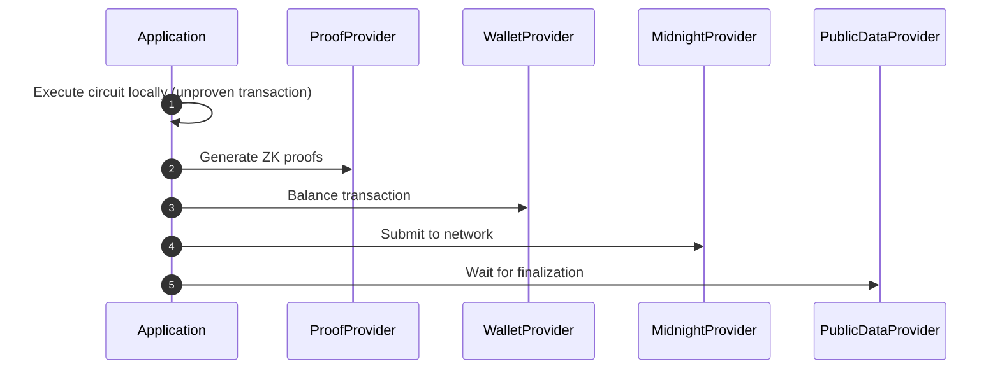

import Tabs from '@theme/Tabs';
import TabItem from '@theme/TabItem';

# Midnight.js

Midnight.js는 smart contract를 배포하고 호출하며, 암호화된 비공개 상태를 관리하고, 영지식 증명을 생성해 Midnight 네트워크에 트랜잭션을 제출하는 도구를 제공합니다.

이 문서에서는 Midnight.js SDK의 구조와 패키지 구성, 그리고 시작하는 방법을 전반적으로 설명합니다.

## Prerequisites

Midnight.js를 사용하기 전에 다음이 준비되어 있어야 합니다.

- [Node.js](https://nodejs.org/) 22.x 이상
- 실행 중인 [Docker](https://www.docker.com/) — [proof server](../../guides/run-proof-server) 구동에 필요합니다

## Packages

Midnight.js는 모듈식 구조를 따르며, 각 패키지가 하나의 기능을 담당합니다.

### Core

core 패키지는 SDK의 기반 기능을 제공합니다.

| 패키지 | 용도 |
|---------|---------|
| `@midnight-ntwrk/midnight-js-types` | 공통 타입, 인터페이스, provider 계약 |
| `@midnight-ntwrk/midnight-js-contracts` | 컨트랙트 배포, circuit 호출, 트랜잭션 제출 |
| `@midnight-ntwrk/midnight-js-network-id` | 런타임 및 ledger WASM API용 네트워크 식별자 설정 |
| `@midnight-ntwrk/midnight-js-utils` | 공통 유틸리티(hex 인코딩, bech32m, assertion) |

### Providers

provider 패키지는 증명 생성, 비공개 상태 관리, 공개 데이터 조회 기능을 담당합니다.

| 패키지 | 용도 |
|---------|---------|
| `@midnight-ntwrk/midnight-js-indexer-public-data-provider` | GraphQL 기반 블록체인 데이터 provider(쿼리 및 구독) |
| `@midnight-ntwrk/midnight-js-level-private-state-provider` | [LevelDB](https://github.com/Level/level)를 사용한 AES-256-GCM 암호화 영속 상태 저장소 |
| `@midnight-ntwrk/midnight-js-http-client-proof-provider` | Midnight proof server용 HTTP 클라이언트 |
| `@midnight-ntwrk/midnight-js-fetch-zk-config-provider` | [Fetch API](https://developer.mozilla.org/en-US/docs/Web/API/Fetch_API)를 사용하는 브라우저 호환 영지식 아티팩트 provider |
| `@midnight-ntwrk/midnight-js-node-zk-config-provider` | Node.js 파일 시스템 기반 ZK 아티팩트 provider |
| `@midnight-ntwrk/midnight-js-logger-provider` | 애플리케이션별 [Pino](https://github.com/pinojs/pino) 로거 설정 |

### Tooling

tooling 패키지는 Compact smart contract 컴파일에 필요한 도구를 제공합니다.

| 패키지 | 용도 |
|---------|---------|
| `@midnight-ntwrk/midnight-js-compact` | 컨트랙트 컴파일을 위한 Compact 컴파일러 관리자 |

## Installation

SDK 전체를 하나의 진입점으로 제공하는 barrel 패키지를 설치하려면 다음과 같이 실행하세요.

<Tabs groupId="package-manager">
<TabItem value="npm">
```bash
npm install @midnight-ntwrk/midnight-js
```
</TabItem>
<TabItem value="yarn">
```bash
yarn add @midnight-ntwrk/midnight-js
```
</TabItem>
</Tabs>

개별 패키지를 설치하려면 다음과 같이 실행하세요.

<Tabs groupId="package-manager">
<TabItem value="npm">

```bash
npm install @midnight-ntwrk/midnight-js-types
npm install @midnight-ntwrk/midnight-js-contracts
npm install @midnight-ntwrk/midnight-js-network-id
npm install @midnight-ntwrk/midnight-js-utils
npm install @midnight-ntwrk/midnight-js-indexer-public-data-provider
npm install @midnight-ntwrk/midnight-js-level-private-state-provider
npm install @midnight-ntwrk/midnight-js-http-client-proof-provider
npm install @midnight-ntwrk/midnight-js-fetch-zk-config-provider
npm install @midnight-ntwrk/midnight-js-node-zk-config-provider
npm install @midnight-ntwrk/midnight-js-logger-provider
npm install @midnight-ntwrk/ledger-v8
```

</TabItem>
<TabItem value="yarn">
```bash
yarn add @midnight-ntwrk/midnight-js-types
yarn add @midnight-ntwrk/midnight-js-contracts
yarn add @midnight-ntwrk/midnight-js-network-id
yarn add @midnight-ntwrk/midnight-js-utils
yarn add @midnight-ntwrk/midnight-js-indexer-public-data-provider
yarn add @midnight-ntwrk/midnight-js-level-private-state-provider
yarn add @midnight-ntwrk/midnight-js-http-client-proof-provider
yarn add @midnight-ntwrk/midnight-js-fetch-zk-config-provider
yarn add @midnight-ntwrk/midnight-js-node-zk-config-provider
yarn add @midnight-ntwrk/midnight-js-logger-provider
yarn add @midnight-ntwrk/ledger-v8
```
</TabItem>
</Tabs>
:::important

SDK 버전이 Midnight Network의 다른 컴포넌트와 어떻게 맞물리는지는 [호환성 매트릭스](../../relnotes/support-matrix)에서 항상 먼저 확인하세요.

:::

## Configure the network

네트워크 ID는 SDK가 사용할 네트워크를 지정합니다. Midnight Network에서 작업하려면 목적에 맞는 네트워크 ID를 설정해야 합니다.
다른 Midnight.js 라이브러리와 컴포넌트도 이 네트워크 ID를 기준으로 네트워크 작업을 수행합니다.

<Tabs groupId="network">
<TabItem value="preprod">

```typescript
import { setNetworkId } from '@midnight-ntwrk/midnight-js-network-id';

setNetworkId('preprod');

export const CONFIG = {
  indexer: 'https://indexer.preprod.midnight.network/api/v4/graphql',
  indexerWS: 'wss://indexer.preprod.midnight.network/api/v4/graphql/ws',
  node: 'https://rpc.preprod.midnight.network',
  proofServer: 'http://127.0.0.1:6300',
};
```
</TabItem>
<TabItem value="undeployed">
```typescript
import { setNetworkId } from '@midnight-ntwrk/midnight-js-network-id';

setNetworkId('undeployed');

export const CONFIG = {
  indexer: 'http://localhost:8088/api/v4/graphql',
  indexerWS: 'ws://localhost:8088/api/v4/graphql/ws',
  node: 'ws://localhost:9944',
  proofServer: 'http://localhost:6300',
};
```

:::note

undeployed 네트워크는 블록체인에 배포되지 않은 로컬 네트워크로, 테스트와 개발 용도로 사용합니다.
자세한 내용은 [Midnight 로컬 네트워크](../../guides/midnight-local-network) 문서를 참고하세요.

:::

</TabItem>
</Tabs>

사용할 수 있는 네트워크는 다음과 같습니다.

| Network | Network ID |
|---------|------------|
| Mainnet | `mainnet` |
| Preview | `preview` |
| Preprod | `preprod` |
| Undeployed | `undeployed` |

Node.js 환경에서는 GraphQL 구독을 위해 WebSocket을 활성화하세요.

```typescript
import { WebSocket } from 'ws';

globalThis.WebSocket = WebSocket;
```

## Configure providers

provider는 교체 가능한 모듈식 컴포넌트로, Midnight 블록체인에 트랜잭션을 구성하고 제출하는 데 필요한 기능을 하나씩 나눠 담당합니다.

```typescript
import { levelPrivateStateProvider } from '@midnight-ntwrk/midnight-js-level-private-state-provider';
import { indexerPublicDataProvider } from '@midnight-ntwrk/midnight-js-indexer-public-data-provider';
import { httpClientProofProvider } from '@midnight-ntwrk/midnight-js-http-client-proof-provider';
import { FetchZkConfigProvider } from '@midnight-ntwrk/midnight-js-fetch-zk-config-provider';
import * as ledger from '@midnight-ntwrk/ledger-v8';

const zkConfigProvider = new FetchZkConfigProvider(zkArtifactsUrl);

const providers: MidnightProviders = {
  privateStateProvider: levelPrivateStateProvider({
    privateStoragePasswordProvider: () => password,
    accountId: walletAddress,
  }),
  publicDataProvider: indexerPublicDataProvider(queryUrl, subscriptionUrl),
  zkConfigProvider,
  proofProvider: httpClientProofProvider(proofServerUrl, zkConfigProvider),
  walletProvider,    // from @midnight-ntwrk/wallet-sdk-facade
  midnightProvider,  // from @midnight-ntwrk/wallet-sdk-facade
};
```

:::info
`walletProvider`와 `midnightProvider`는 트랜잭션 밸런싱과 블록체인 제출을 담당하며, Wallet SDK 패키지가 제공합니다. 자세한 내용은 [Wallet SDK](./wallet-developer-guide) 문서를 참고하세요.
:::

proof provider에 ZK 설정을 넘길 때는 `FetchZkConfigProvider`와 `NodeZkConfigProvider` 중 하나를 사용합니다.

### Fetch ZK configuration provider

HTTP/HTTPS로 proving key, verifier key, ZK 중간 표현을 가져오는 ZK 설정 provider입니다.

`FetchZkConfigProvider` 사용 예시는 다음과 같습니다.

```typescript
import { FetchZkConfigProvider } from '@midnight-ntwrk/midnight-js-fetch-zk-config-provider';

const zkConfigProvider = new FetchZkConfigProvider('https://example.com/zk-artifacts');

const proverKey = await zkConfigProvider.getProverKey('myCircuit');
const verifierKey = await zkConfigProvider.getVerifierKey('myCircuit');
const zkir = await zkConfigProvider.getZKIR('myCircuit');
```

### Node ZK configuration provider

파일 시스템에서 proving key, verifier key, ZK 중간 표현을 가져오는 ZK 설정 provider입니다.

`NodeZkConfigProvider` 사용 예시는 다음과 같습니다.

```typescript
import { NodeZkConfigProvider } from '@midnight-ntwrk/midnight-js-node-zk-config-provider';

const zkConfigProvider = new NodeZkConfigProvider('/path/to/zk-artifacts');

const proverKey = await zkConfigProvider.getProverKey('myCircuit');
const verifierKey = await zkConfigProvider.getVerifierKey('myCircuit');
const zkir = await zkConfigProvider.getZKIR('myCircuit');
```

### DApp Connector proof provider

영지식 증명 생성을 DApp Connector 지갑에 위임하는 proof provider 구현입니다.
DApp이 브라우저에서 동작하고 증명 생성을 사용자 지갑이 맡는 경우에 사용하세요.

`@midnight-ntwrk/dapp-connector-proof-provider` 패키지를 설치하세요.

```bash
npm install @midnight-ntwrk/dapp-connector-proof-provider
```

`dappConnectorProofProvider` 함수로 proof provider를 만듭니다.

```typescript
import { dappConnectorProofProvider } from '@midnight-ntwrk/midnight-js-dapp-connector-proof-provider';

const proofProvider = await dappConnectorProofProvider(
  walletConnectedAPI,
  zkConfigProvider,
  costModel
);

const provenTx = await proofProvider.proveTx(unprovenTx);
```

`dappConnectorProofProvider` 함수에는 다음 매개변수가 _반드시_ 필요합니다.
- `walletConnectedAPI`: 증명 생성 기능을 갖춘 DApp Connector 지갑 API
- `zkConfigProvider`: ZK 설정 아티팩트를 제공하는 provider
- `costModel`: 트랜잭션 증명에 사용할 비용 모델

:::note

지갑 연결은 DApp Connector API가 처리하며, `walletConnectedAPI` 매개변수도 여기서 나옵니다. 자세한 내용은 [DApp Connector](/api-reference/dapp-connector) API 레퍼런스를 참고하세요.

:::

## Deploy a smart contract

`deployContract` 메서드는 smart contract를 블록체인에 배포합니다. 매개변수는 다음과 같습니다.

- `providers`: provider 객체
- `compiledContract`: 컴파일된 컨트랙트
- `privateStateId`: 비공개 상태 ID
- `initialPrivateState`: 초기 비공개 상태

```typescript
import { deployContract } from '@midnight-ntwrk/midnight-js-contracts';

const deployed = await deployContract(providers, {
  compiledContract,
  privateStateId: 'my-state',
  initialPrivateState: { counter: 0n },
});

```

`deployContract` 메서드는 `deployedContract` promise를 반환합니다. 이 객체에는 컨트랙트 주소와 비공개 상태 ID가 담겨 있습니다.

```typescript
const contractAddress = deployed.deployTxData.public.contractAddress;
console.log(`Contract Address: ${contractAddress}`);
```

## Interact with the contract

배포된 컨트랙트를 다루려면 `findDeployedContract` 메서드로 컨트랙트 객체를 가져오세요.

```typescript
import { findDeployedContract } from '@midnight-ntwrk/midnight-js-contracts';

const contract = await findDeployedContract(providers, {
  contractAddress: contractAddress,
  compiledContract,
  privateStateId: 'my-state',
  initialPrivateState: {},
});

```
이 메서드의 매개변수는 다음과 같습니다.

- `providers`: provider 객체
- 다음 속성을 담은 options 객체
  - `contractAddress`: 컨트랙트 주소
  - `compiledContract`: 컴파일된 컨트랙트
  - `privateStateId`: 비공개 상태 ID
  - `initialPrivateState`: 초기 비공개 상태

컨트랙트 객체를 초기화하고 나면 `callTx` 속성으로 smart contract의 circuit을 호출할 수 있습니다.

```typescript
const transaction = await contract.callTx.someCircuit(circuitArguments);
```

이 호출은 새 트랜잭션을 만들어 블록체인에 제출합니다. 트랜잭션 정보는 다음과 같이 확인합니다.

```typescript
const transaction = await contract.callTx.someCircuit(circuitArguments);
console.log('Transaction ID:', transaction.public.txId);
console.log(`Block: ${transaction.public.blockHeight}\n`);
```

## Transaction submission

트랜잭션 페이로드나 options 객체를 이미 만들어 둔 경우, 아래 헬퍼로 설정된 provider를 통해 call·deploy·일반 트랜잭션을 제출할 수 있습니다.
`contract.callTx.*` 편의 메서드를 쓰지 않고 제출 과정을 직접 제어할 때 유용합니다.

```typescript
import { submitCallTx, submitDeployTx, submitTx } from '@midnight-ntwrk/midnight-js-contracts';

// Submit a call transaction
await submitCallTx(providers, callOptions);

// Submit a deploy transaction
await submitDeployTx(providers, deployOptions);

// Generic transaction submission
await submitTx(providers, txData);
```

## Query state

smart contract를 배포한 뒤에는 `getStates`와 `getPublicStates` 메서드로 컨트랙트의 비공개 상태와 공개 상태를 조회할 수 있습니다.

```typescript
import { getStates, getPublicStates } from '@midnight-ntwrk/midnight-js-contracts';

const states = await getStates(providers, contractAddress, privateStateId);
const publicStates = await getPublicStates(providers, contractAddress);
```

`getStates` 메서드는 지정한 provider를 통해, 주어진 식별자에 해당하는 배포된 smart contract의 Zswap 상태, ledger 상태, 비공개 상태를 가져옵니다.

매개변수는 다음과 같습니다.
- `providers`: provider 객체
- `contractAddress`: 컨트랙트 주소
- `privateStateId`: 비공개 상태 ID

`getPublicStates` 메서드는 배포된 smart contract에서 외부에 공개되는 상태(Zswap과 ledger)만 가져옵니다. 매개변수는 다음과 같습니다.

- `providers`: provider 객체
- `contractAddress`: 컨트랙트 주소

컨트랙트의 unshielded 잔액은 `getUnshieldedBalances` 메서드에 provider 객체와 컨트랙트 주소를 넘겨 조회합니다.

```typescript
const balances = await getUnshieldedBalances(providers, contractAddress);
console.log('Unshielded Balances:', balances);
```

## Key concepts

Midnight.js SDK의 동작 방식을 이해하려면 다음 개념을 알아두어야 합니다.

### Contract model

컨트랙트 모델에서는 다음 용어를 사용합니다.

- **Circuit**: 로컬에서 실행되어 영지식 증명을 생성하는 smart contract 함수
- **Witness**: 최종 사용자의 기기에서 실행되는 비공개 연산
- **Private state**: circuit이 갱신하는 사용자 로컬 상태로, 온체인에 저장되지 않음
- **Ledger state**: 온체인에 공개되는 컨트랙트 상태

### ZK artifacts

ZK 아티팩트는 영지식 증명을 만들기 위해 Compact 컴파일러가 생성하는 파일입니다. 다음 파일이 포함됩니다.

- **Prover key**: 영지식 증명을 생성할 때 쓰는 바이너리
- **Verifier key**: 온체인에서 증명을 검증할 때 쓰는 바이너리
- **ZKIR**: 컴파일된 컨트랙트의 영지식 중간 표현(Zero-Knowledge Intermediate Representation)

### Transaction flow

컨트랙트 호출을 제출하면 먼저 로컬에서 실행되어 증명이 없는 트랜잭션이 만들어집니다.
그다음 타입이 지정된 provider들이 차례로 증명을 생성하고, 트랜잭션을 밸런싱한 뒤 네트워크에 전파합니다.아래 다이어그램이 그 흐름을 정리한 것입니다.



### Transaction status

트랜잭션 상태는 다음 세 가지입니다.

- `SucceedEntirely`: 트랜잭션의 모든 구간이 성공
- `FailFallible`: guaranteed 구간은 성공했으나 fallible 구간이 실패
- `FailEntirely`: 트랜잭션이 유효하지 않음
