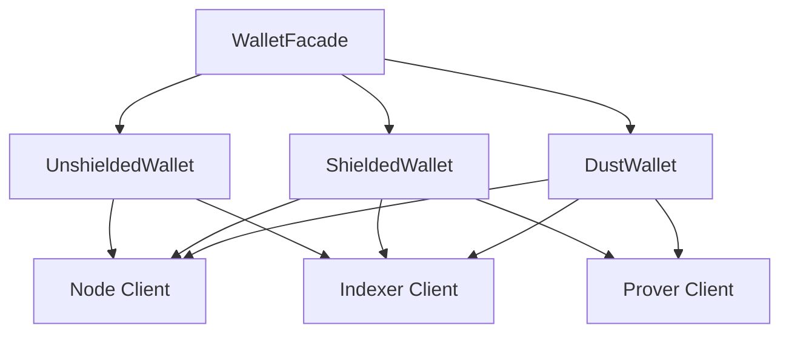

import Tabs from '@theme/Tabs';
import TabItem from '@theme/TabItem';

# Midnight wallet SDK

Midnight wallet SDK은 Midnight Network 지갑 관리를 위한 TypeScript SDK입니다.
Midnight의 세 가지 토큰 시스템을 모두 지원합니다:

- **Unshielded tokens**: NIGHT 및 기타 비차폐 토큰
- **Shielded tokens**: 영지식 증명이 적용된 차폐 토큰
- **DUST**: 트랜잭션 수수료를 위한 DUST

이 가이드에서는 wallet SDK으로 지갑을 구성하고 운영하는 방법을 설명합니다.

## Packages

Midnight wallet SDK은 기능별 패키지로 나뉜 모듈식 구조입니다. 구성 패키지는 다음과 같습니다:

| Package | Purpose |
|---------|---------|
| `@midnight-ntwrk/wallet-sdk-facade` | 모든 지갑 운영을 위한 통합 API |
| `@midnight-ntwrk/wallet-sdk-unshielded-wallet` | NIGHT 및 비차폐 토큰 관리 |
| `@midnight-ntwrk/wallet-sdk-shielded` | ZK 증명이 적용된 차폐 토큰 관리 |
| `@midnight-ntwrk/wallet-sdk-dust-wallet` | 트랜잭션 수수료를 위한 DUST 관리 |
| `@midnight-ntwrk/wallet-sdk-hd` | 계층적 결정성(HD) 키 파생 |
| `@midnight-ntwrk/wallet-sdk-address-format` | Bech32m 주소 인코딩 및 디코딩 |
| `@midnight-ntwrk/wallet-sdk-node-client` | Midnight 노드와의 통신 |
| `@midnight-ntwrk/wallet-sdk-indexer-client` | Midnight 인덱서 조회 |
| `@midnight-ntwrk/wallet-sdk-prover-client` | 증명 서버와의 인터페이스 |

각 패키지의 상세 내용은 [wallet SDK 릴리스 노트](../../relnotes/wallet/)를 참고하세요.

## Installation

사용 중인 패키지 매니저에 맞게 wallet SDK을 설치하세요:

<Tabs>
  <TabItem value="npm">
    ```bash
    npm install @midnight-ntwrk/wallet-sdk-facade@VERSION \
                @midnight-ntwrk/wallet-sdk-hd@VERSION \
                @midnight-ntwrk/wallet-sdk-address-format@VERSION \
                @midnight-ntwrk/wallet-sdk-unshielded-wallet@VERSION \
                @midnight-ntwrk/wallet-sdk-shielded@VERSION \
                @midnight-ntwrk/wallet-sdk-dust-wallet@VERSION \
                @midnight-ntwrk/ledger-v7@VERSION
    ```
  </TabItem>
  <TabItem value="yarn">
    ```bash
    yarn add @midnight-ntwrk/wallet-sdk-facade@VERSION \
                @midnight-ntwrk/wallet-sdk-hd@VERSION \
                @midnight-ntwrk/wallet-sdk-address-format@VERSION \
                @midnight-ntwrk/wallet-sdk-unshielded-wallet@VERSION \
                @midnight-ntwrk/wallet-sdk-shielded@VERSION \
                @midnight-ntwrk/wallet-sdk-dust-wallet@VERSION \
                @midnight-ntwrk/ledger-v7@VERSION
    ```
  </TabItem>
</Tabs>

`VERSION` 부분은 [릴리스 호환성 매트릭스](../../relnotes/support-matrix)에서 확인한 호환 버전으로 바꾸세요.

## Wallet architecture

Wallet SDK은 Midnight의 토큰 모델에 맞춰 세 가지 지갑으로 구성됩니다:



- **WalletFacade**: 세 지갑을 하나로 묶는 통합 인터페이스
- **UnshieldedWallet**: UTxO 모델 기반으로 NIGHT 등 비차폐 토큰을 관리
- **ShieldedWallet**: ZK 증명으로 프라이버시를 보장하는 차폐 토큰을 관리
- **DustWallet**: 트랜잭션 수수료 지불에 사용하는 DUST을 관리

## Derive wallet keys

Wallet SDK은 BIP-32/BIP-44/CIP-1852 표준에 따른 HD(계층적 결정성) 키 파생을 사용합니다. 세 지갑 모두 하나의 시드에서 키를 파생합니다.

### Derivation path

SDK은 다음과 같은 파생 경로를 따릅니다:

```
m / 44' / 2400' / account' / role / index
```

경로 구성 요소:

- `account`: 계정 인덱스로, 일반적으로 첫 번째 계정은 0
- `role`: 키의 용도를 결정하는 지갑 유형 식별자:
  - `0` (Roles.NightExternal): 비차폐 운영
  - `3` (Roles.Zswap): 차폐 운영
  - `4` (Roles.Dust): DUST 토큰 운영
- `index`: 주소 인덱스로, 일반적으로 기본 주소는 0

### Derive keys from a seed

하나의 마스터 시드에서 비차폐, 차폐, DUST 키를 파생하는 예제입니다. 키 파생이 실패하면 BIP-44 표준에 따라 다음 인덱스로 자동 재시도합니다.

```typescript
import * as ledger from '@midnight-ntwrk/ledger-v7';
import type { Role } from '@midnight-ntwrk/wallet-sdk-hd';
import { AccountKey, HDWallet, Roles } from '@midnight-ntwrk/wallet-sdk-hd';
import { Buffer } from 'buffer';

function deriveRoleKey(accountKey: AccountKey, role: Role, addressIndex: number = 0): Buffer {
  const result = accountKey.selectRole(role).deriveKeyAt(addressIndex);

  if (result.type === 'keyDerived') {
    return Buffer.from(result.key);
  }

  // There is small possibility of the derivation failing, so we retry with the next index as specified
  return deriveRoleKey(accountKey, role, addressIndex + 1);
}

function deriveAllKeys(seed: Uint8Array) {
  const hdWallet = HDWallet.fromSeed(seed);

  if (hdWallet.type !== 'seedOk') {
    throw new Error('Failed to derive keys');
  }

  const account = hdWallet.hdWallet.selectAccount(0);
  const shieldedSeed = deriveRoleKey(account, Roles.Zswap);
  const dustSeed = deriveRoleKey(account, Roles.Dust);
  const unshieldedKey = deriveRoleKey(account, Roles.NightExternal);

  hdWallet.hdWallet.clear(); // Clear the HDWallet to avoid holding the private key in memory for longer than needed

  return {
    shielded: { seed: shieldedSeed, keys: ledger.ZswapSecretKeys.fromSeed(shieldedSeed) },
    dust: { seed: dustSeed, key: ledger.DustSecretKey.fromSeed(dustSeed) },
    unshielded: unshieldedKey,
  };
}
```
### Example usage

마스터 시드에서 세 가지 키를 파생하는 사용 예시입니다.

```typescript
const seed = Buffer.from(
  '0000000000000000000000000000000000000000000000000000000000000001',
  'hex'
);
const derivedKeys = deriveAllKeys(seed);

// Clear the seed from memory after use
seed.fill(0);

console.log('Derived keys successfully');
console.log('Unshielded (Night) secret key:', derivedKeys.unshielded.toString('hex'));
console.log('Shielded seed:', derivedKeys.shielded.seed.toString('hex'));
console.log('DUST seed:', derivedKeys.dust.seed.toString('hex'));
```

:::warning Security
키 파생이 끝나면 반드시 HD wallet을 초기화하세요. 시드가 메모리에 불필요하게 남아 있지 않도록 해야 합니다.
:::

## Initialize the wallet

`WalletFacade`은 모든 지갑 작업을 하나로 묶는 통합 인터페이스입니다. 설정 정보와 각 지갑의 비밀 키로 초기화하세요.

### Configuration

먼저 네트워크 엔드포인트, 비용 파라미터, 트랜잭션 기록 저장소를 지정하는 설정 객체를 만드세요. Preprod 테스트넷과 로컬 개발 네트워크의 설정이 다릅니다.

<Tabs>
  <TabItem value="preprod">
```typescript
import { type DefaultConfiguration } from '@midnight-ntwrk/wallet-sdk-facade';
import { InMemoryTransactionHistoryStorage } from '@midnight-ntwrk/wallet-sdk-unshielded-wallet';

const configuration: DefaultConfiguration = {
  networkId: 'preprod',
  costParameters: {
    additionalFeeOverhead: 300_000_000_000_000n,
    feeBlocksMargin: 5,
  },
  relayURL: new URL('wss://rpc.preprod.midnight.network'),
  provingServerUrl: new URL('http://localhost:6300'),
  indexerClientConnection: {
    indexerHttpUrl: 'https://indexer.preprod.midnight.network/api/v3/graphql',
    indexerWsUrl: 'wss://indexer.preprod.midnight.network/api/v3/graphql/ws',
  },
  txHistoryStorage: new InMemoryTransactionHistoryStorage(),
};
```
  </TabItem>
  <TabItem value="undeployed">
```typescript
import { type DefaultConfiguration } from '@midnight-ntwrk/wallet-sdk-facade';
import { InMemoryTransactionHistoryStorage } from '@midnight-ntwrk/wallet-sdk-unshielded-wallet';

const INDEXER_PORT = Number.parseInt(process.env['INDEXER_PORT'] ?? '8088', 10);
const NODE_PORT = Number.parseInt(process.env['NODE_PORT'] ?? '9944', 10);
const PROOF_SERVER_PORT = Number.parseInt(process.env['PROOF_SERVER_PORT'] ?? '6300', 10);
const INDEXER_HTTP_URL = `http://localhost:${INDEXER_PORT}/api/v3/graphql`;
const INDEXER_WS_URL = `ws://localhost:${INDEXER_PORT}/api/v3/graphql/ws`;

const configuration: DefaultConfiguration = {
  networkId: 'undeployed',
  costParameters: {
    additionalFeeOverhead: 300_000_000_000_000n,
    feeBlocksMargin: 5,
  },
  relayURL: new URL(`ws://localhost:${NODE_PORT}`),
  provingServerUrl: new URL(`http://localhost:${PROOF_SERVER_PORT}`),
  indexerClientConnection: {
    indexerHttpUrl: INDEXER_HTTP_URL,
    indexerWsUrl: INDEXER_WS_URL,
  },
  txHistoryStorage: new InMemoryTransactionHistoryStorage(),
};

```
</TabItem>
</Tabs>

### Complete initialization

키 파생부터 키스토어 생성, 세 지갑 시작까지 전체 초기화 과정을 보여주는 예제입니다. 네트워크 동기화 전에 키 관리와 지갑 설정이 올바르게 완료됩니다.

```typescript
import * as ledger from '@midnight-ntwrk/ledger-v7';
import { DustWallet } from '@midnight-ntwrk/wallet-sdk-dust-wallet';
import { WalletFacade } from '@midnight-ntwrk/wallet-sdk-facade';
import { ShieldedWallet } from '@midnight-ntwrk/wallet-sdk-shielded';
import {
  createKeystore,
  PublicKey,
  UnshieldedWallet,
} from '@midnight-ntwrk/wallet-sdk-unshielded-wallet';

async function initWallet(seed: Buffer) {
  // Derive keys
  const derivedKeys = deriveAllKeys(seed);

  const unshieldedKeystore = createKeystore(
    derivedKeys.unshielded,
    configuration.networkId
  );

  // Initialize wallet facade
  const wallet = await WalletFacade.init({
    configuration,
    shielded: (config) =>
      ShieldedWallet(config).startWithSecretKeys(derivedKeys.shielded.keys),
    unshielded: (config) =>
      UnshieldedWallet(config).startWithPublicKey(
        PublicKey.fromKeyStore(unshieldedKeystore)
      ),
    dust: (config) =>
      DustWallet(config).startWithSecretKey(
        derivedKeys.dust.key,
        ledger.LedgerParameters.initialParameters().dust
      ),
  });

  await wallet.start(derivedKeys.shielded.keys, derivedKeys.dust.key);

  return { wallet, derivedKeys, unshieldedKeystore };
}
```

전체 예제는 [초기화 스니펫](https://github.com/midnightntwrk/midnight-wallet/blob/main/packages/docs-snippets/src/snippets/initialization.ts)을 참고하세요.

## Wallet state

지갑은 블록체인 동기화에 따라 자동 갱신되는 Observable 상태를 제공합니다.

### Access wallet state

현재 상태 스냅샷을 조회하거나 상태 변경을 구독할 수 있습니다. 작업 전에 `waitForSyncedState()`로 초기 동기화가 끝날 때까지 대기하세요.

```typescript
import * as rx from 'rxjs';

// Wait for initial sync
const syncedState = await wallet.waitForSyncedState();

console.log('Shielded balance:', syncedState.shielded.balances);
console.log('Unshielded balance:', syncedState.unshielded.balances);
console.log('DUST balance:', syncedState.dust.totalCoins);

// Subscribe to state changes
wallet.state().subscribe((state) => {
  if (state.isSynced) {
    console.log('Wallet is synced');
    console.log('Shielded coins:', state.shielded.availableCoins.length);
    console.log('Unshielded UTxOs:', state.unshielded.availableCoins.length);
  }
});
```

### Wallet state structure

지갑 상태에 포함되는 항목은 다음과 같습니다:

- **Balances**: 토큰 유형별로 그룹화된 토큰 수량
- **Available coins**: 사용 가능한 코인
- **Pending coins**: 확인 대기 중인 코인
- **Progress**: 동기화 상태
- **Addresses**: 각 지갑 유형의 Bech32m 인코딩 주소

## Address encoding

Midnight은 모든 주소에 Bech32m 형식을 사용합니다. SDK에서 인코딩/디코딩 유틸리티를 제공합니다.

### Address types

Midnight은 세 가지 주소 유형을 지원합니다:

| Prefix | Type | Description |
|--------|------|-------------|
| `mn_addr` | Unshielded | NIGHT 및 비차폐 토큰의 결제 주소 |
| `mn_shield-addr` | Shielded | 차폐 토큰의 결제 주소 |
| `mn_dust` | DUST | DUST 생성용 주소 |

각 접두사에는 네트워크 식별자가 포함됩니다:
- **Mainnet**: 접미사 없음 (예: `mn_addr`)
- **Preprod**: `_preprod` 접미사 (예: `mn_addr_preprod`)
- **Preview**: `_preview` 접미사
- **Undeployed**: `_undeployed` 접미사

### Encode addresses

원시 공개 키와 주소를 사람이 읽을 수 있는 Bech32m 형식으로 변환합니다. 인코딩된 주소에는 네트워크 식별자가 포함되어, 사용자에게 공유하거나 UI에 표시하기 적합합니다. 지갑 유형마다 키 구조가 다르므로 인코딩 방식도 다릅니다.

```typescript
import {
  MidnightBech32m,
  UnshieldedAddress,
  ShieldedAddress,
  DustAddress,
  ShieldedCoinPublicKey,
  ShieldedEncryptionPublicKey,
} from '@midnight-ntwrk/wallet-sdk-address-format';
import * as ledger from '@midnight-ntwrk/ledger-v7';

const networkId = 'preprod';

// Encode unshielded address
const verifyingKey = ledger.signatureVerifyingKey(unshieldedSecretKey.toString('hex'));
const unshieldedAddress = new UnshieldedAddress(
  Buffer.from(ledger.addressFromKey(verifyingKey), 'hex')
);
const unshieldedBech32m = MidnightBech32m.encode(networkId, unshieldedAddress).toString();

// Encode shielded address
const shieldedKeys = ledger.ZswapSecretKeys.fromSeed(shieldedSeed);
const shieldedAddress = new ShieldedAddress(
  new ShieldedCoinPublicKey(Buffer.from(shieldedKeys.coinPublicKey, 'hex')),
  new ShieldedEncryptionPublicKey(Buffer.from(shieldedKeys.encryptionPublicKey, 'hex'))
);
const shieldedBech32m = MidnightBech32m.encode(networkId, shieldedAddress).toString();

// Encode dust address
const dustSecretKey = ledger.DustSecretKey.fromSeed(dustSeed);
const dustAddress = new DustAddress(dustSecretKey.publicKey);
const dustBech32m = MidnightBech32m.encode(networkId, dustAddress).toString();
```

### Decode addresses

Bech32m 주소를 원시 바이트로 다시 변환합니다. 암호화 연산이나 트랜잭션 구성, 검증 시 공개 키나 주소 바이트를 추출할 때 사용합니다. 디코딩 과정에서 주소 형식과 네트워크 식별자도 함께 검증됩니다.

```typescript
// Parse and decode unshielded address
const parsedUnshielded = MidnightBech32m.parse(unshieldedBech32m);
const decodedUnshielded = parsedUnshielded.decode(UnshieldedAddress, networkId);

// Parse and decode shielded address
const parsedShielded = MidnightBech32m.parse(shieldedBech32m);
const decodedShielded = parsedShielded.decode(ShieldedAddress, networkId);
```

전체 주소 예제는 [주소 스니펫](https://github.com/midnightntwrk/midnight-wallet/blob/main/packages/docs-snippets/src/snippets/addresses.no-net.ts)을 참고하세요.

## Make transfers

토큰 전송을 위한 고수준 메서드를 제공합니다. 아래 예제는 [Initialize the wallet](#initialize-the-wallet)에 따라 지갑 초기화와 키 파생이 완료된 상태를 전제합니다.

### Unshielded transfers

표준 UTxO 기반 트랜잭션으로 주소 간에 NIGHT 등 비차폐 토큰을 전송합니다. 블록체인에 공개되며, 비차폐 비밀 키로 서명해야 합니다.

```typescript
import * as ledger from '@midnight-ntwrk/ledger-v7';

await wallet
  .transferTransaction(
    [
      {
        type: 'unshielded',
        outputs: [
          {
            amount: 1_000_000n,
            receiverAddress: await receiverWallet.unshielded.getAddress(),
            type: ledger.unshieldedToken().raw,
          },
        ],
      },
    ],
    {
      shieldedSecretKeys,
      dustSecretKey,
    },
    {
      ttl: new Date(Date.now() + 30 * 60 * 1000),
    }
  )
  .then((recipe) => wallet.signRecipe(recipe, (payload) => keystore.signData(payload)))
  .then((recipe) => wallet.finalizeRecipe(recipe))
  .then((tx) => wallet.submitTransaction(tx));
```

비차폐 전송은 Schnorr 서명을 사용하므로 비차폐 비밀 키가 필요합니다.

### Shielded transfers

영지식 증명으로 토큰을 비공개 전송합니다. 트랜잭션 금액과 참여자 정보가 외부에 노출되지 않으면서도 정확성은 검증 가능합니다. 비차폐 서명은 필요하지 않습니다.

```typescript
await wallet
  .transferTransaction(
    [
      {
        type: 'shielded',
        outputs: [
          {
            amount: 1_000_000n,
            receiverAddress: await receiverWallet.shielded.getAddress(),
            type: ledger.shieldedToken().raw,
          },
        ],
      },
    ],
    {
      shieldedSecretKeys,
      dustSecretKey,
    },
    {
      ttl: new Date(Date.now() + 30 * 60 * 1000),
    }
  )
  .then((recipe) => wallet.finalizeRecipe(recipe))
  .then((tx) => wallet.submitTransaction(tx));
```

:::note
차폐 전송은 모든 작업이 영지식 증명으로 검증되므로 별도의 비차폐 서명이 필요 없습니다.
:::

### Combined transfers

비차폐 전송과 차폐 전송을 하나의 원자적 트랜잭션으로 결합할 수 있습니다. 서로 다른 토큰 유형을 한 번에 전송하므로 오버헤드가 줄고, 둘 다 성공하거나 둘 다 실패합니다.

```typescript
await wallet
  .transferTransaction(
    [
      {
        type: 'unshielded',
        outputs: [
          {
            amount: 1_000_000n,
            receiverAddress: await receiverWallet.unshielded.getAddress(),
            type: ledger.unshieldedToken().raw,
          },
        ],
      },
      {
        type: 'shielded',
        outputs: [
          {
            amount: 1_000_000n,
            receiverAddress: await receiverWallet.shielded.getAddress(),
            type: ledger.shieldedToken().raw,
          },
        ],
      },
    ],
    {
      shieldedSecretKeys,
      dustSecretKey,
    },
    {
      ttl: new Date(Date.now() + 30 * 60 * 1000),
    }
  )
  .then((recipe) => wallet.signRecipe(recipe, (payload) => keystore.signData(payload)))
  .then((recipe) => wallet.finalizeRecipe(recipe))
  .then((tx) => wallet.submitTransaction(tx));
```

## Balance transactions

트랜잭션 밸런싱은 출력과 수수료에 필요한 입력을 자동 선택합니다. 트랜잭션 구성의 여러 단계에서 밸런싱할 수 있습니다. 아래 예제는 비밀 키가 설정된 초기화 완료 상태를 전제합니다.

### Balance an unproven transaction

출력과 수수료를 충당할 적절한 입력을 선택합니다. 영지식 증명 생성 전에 수행해야 하며, 필요한 입력 집합을 지갑이 결정합니다. 아래 예제는 출력을 지정한 트랜잭션 인텐트가 이미 준비된 상태입니다.

```typescript
const unprovenTx = ledger.Transaction.fromParts(
  'preprod',
  undefined,
  undefined,
  intent
);

const balancedRecipe = await wallet.balanceUnprovenTransaction(
  unprovenTx,
  {
    shieldedSecretKeys,
    dustSecretKey,
  },
  {
    ttl: new Date(Date.now() + 30 * 60 * 1000),
  }
);
```

### Balance a finalized transaction

이미 증명이 포함된 확정 트랜잭션에 입력을 추가합니다. 다른 당사자가 수수료를 대납하는 DUST 스폰서십에 특히 유용합니다. `tokenKindsToBalance`로 밸런싱 대상 토큰 유형을 지정하세요.

```typescript
const finalizedRecipe = await wallet.balanceFinalizedTransaction(
  finalizedTx,
  {
    shieldedSecretKeys,
    dustSecretKey,
  },
  {
    ttl: new Date(Date.now() + 30 * 60 * 1000),
    tokenKindsToBalance: ['dust'], // Only balance DUST for fees
  }
);
```

## Manage DUST

DUST은 등록된 NIGHT에서 생성되며 트랜잭션 수수료 지불에 사용됩니다. 아래 예제는 비차폐 키스토어와 비밀 키가 준비된 상태를 전제합니다.

### Register NIGHT for DUST generation

비차폐 NIGHT 코인을 등록하면 시간이 지나면서 DUST 토큰이 생성됩니다. 생성된 DUST은 DUST 지갑에 자동 축적됩니다. 등록한 NIGHT은 비차폐 지갑에 그대로 남아 있으며, 언제든 등록을 해제할 수 있습니다.

```typescript
const { unshielded } = await wallet.waitForSyncedState();

await wallet
  .registerNightUtxosForDustGeneration(
    unshielded.availableCoins,
    unshieldedKeystore.getPublicKey(),
    (payload) => unshieldedKeystore.signData(payload)
  )
  .then((recipe) => wallet.finalizeRecipe(recipe))
  .then((tx) => wallet.submitTransaction(tx));
```

:::info
NIGHT을 등록하면 DUST 생성이 자동으로 시작됩니다. 블록체인에서 등록이 처리된 후에야 DUST이 지갑에 표시됩니다.
:::

### Deregister NIGHT from DUST generation

등록된 NIGHT 코인의 DUST 생성을 중지합니다. 이 작업 자체에 수수료가 필요하므로, 등록 해제 레시피 생성 후 `tokenKindsToBalance: ['dust']`로 밸런싱하세요.

```typescript
const { unshielded } = await wallet.waitForSyncedState();

await wallet
  .deregisterFromDustGeneration(
    [unshielded.availableCoins[0]], // Deregister specific coin
    unshieldedKeystore.getPublicKey(),
    (payload) => unshieldedKeystore.signData(payload)
  )
  .then((recipe) =>
    wallet.balanceUnprovenTransaction(
      recipe.transaction,
      { shieldedSecretKeys, dustSecretKey },
      {
        ttl: new Date(Date.now() + 30 * 60 * 1000),
        tokenKindsToBalance: ['dust'],
      }
    )
  )
  .then((recipe) => wallet.finalizeRecipe(recipe))
  .then((tx) => wallet.submitTransaction(tx));
```

### Redesignate DUST to another address

등록된 NIGHT 코인의 DUST 생성 대상을 다른 DUST 주소로 변경합니다. 다른 지갑이나 서비스에 DUST 생성 권한을 넘길 때 유용합니다. 원자적 작업이며 수수료로 DUST이 필요합니다.

```typescript
await wallet
  .registerNightUtxosForDustGeneration(
    [unshielded.availableCoins[0]],
    unshieldedKeystore.getPublicKey(),
    (payload) => unshieldedKeystore.signData(payload),
    receiverDustAddress // Redirect to this address
  )
  .then((recipe) =>
    wallet.balanceUnprovenTransaction(
      recipe.transaction,
      { shieldedSecretKeys, dustSecretKey },
      {
        ttl: new Date(Date.now() + 30 * 60 * 1000),
        tokenKindsToBalance: ['dust'],
      }
    )
  )
  .then((recipe) => wallet.finalizeRecipe(recipe))
  .then((tx) => wallet.submitTransaction(tx));
```

## DUST sponsorship

DUST 스폰서십을 사용하면 서비스가 사용자 대신 트랜잭션 수수료를 지불할 수 있습니다. 수수료를 보조하려는 DApp에 유용합니다. 아래 예제에서 사용자가 트랜잭션을 준비하면, 스폰서가 수수료용 DUST을 추가합니다.

### Sponsorship workflow

트랜잭션 생성과 수수료 지불을 분리하는 세 단계로 진행됩니다:

1. 사용자가 수수료 없이 트랜잭션을 생성하고 밸런싱합니다
2. 스폰서가 수수료를 위한 DUST을 추가하도록 트랜잭션을 밸런싱합니다
3. 스폰서가 트랜잭션을 제출합니다

```typescript
// User prepares transaction without fees
const userRecipe = await userWallet.balanceUnboundTransaction(
  transaction,
  { shieldedSecretKeys: userShieldedKeys, dustSecretKey: userDustKey },
  {
    ttl: new Date(Date.now() + 30 * 60 * 1000),
    tokenKindsToBalance: ['shielded', 'unshielded'], // No DUST
  }
);

const userSigned = await userWallet.signRecipe(
  userRecipe,
  (payload) => userKeystore.signData(payload)
);

const userFinalized = await userWallet.finalizeRecipe(userSigned);

// Sponsor adds fees and submits
await sponsorWallet
  .balanceFinalizedTransaction(
    userFinalized,
    { shieldedSecretKeys: sponsorShieldedKeys, dustSecretKey: sponsorDustKey },
    {
      ttl: new Date(Date.now() + 30 * 60 * 1000),
      tokenKindsToBalance: ['dust'], // Only add DUST
    }
  )
  .then((recipe) => sponsorWallet.signRecipe(recipe, (payload) => sponsorKeystore.signData(payload)))
  .then((recipe) => sponsorWallet.finalizeRecipe(recipe))
  .then((tx) => sponsorWallet.submitTransaction(tx));
```

## Atomic swaps

아토믹 스왑으로 신뢰 없이(trustless) 당사자 간 토큰을 교환할 수 있습니다. SDK은 하나의 트랜잭션으로 병합 가능한 스왑 제안 생성을 지원합니다. 아래 예제는 양쪽 모두 지갑 초기화가 완료된 상태입니다.

### Create and execute a swap

두 당사자가 참여합니다:
- 개시자가 토큰을 제공하는 부분 트랜잭션을 생성합니다.
- 상대방이 자신의 입력으로 밸런싱하여 스왑을 완료합니다.

지갑이 암호화 작업을 처리하며, 양쪽이 기대하는 토큰을 원자적으로 수령하도록 보장합니다.

```typescript
// Alice initiates swap
const aliceSwapTx = await aliceWallet
  .initSwap(
    { shielded: { [token1]: 1_000_000n } }, // Offer token1
    [
      {
        type: 'shielded',
        outputs: [
          {
            type: token2,
            amount: 1_000_000n,
            receiverAddress: aliceShieldedAddress,
          },
        ],
      },
    ], // Request token2
    { shieldedSecretKeys: aliceShieldedKeys, dustSecretKey: aliceDustKey },
    { ttl: new Date(Date.now() + 30 * 60 * 1000) }
  )
  .then((recipe) => aliceWallet.finalizeRecipe(recipe));

// Bob completes swap by balancing Alice's transaction
await bobWallet
  .balanceFinalizedTransaction(
    aliceSwapTx,
    { shieldedSecretKeys: bobShieldedKeys, dustSecretKey: bobDustKey },
    { ttl: new Date(Date.now() + 30 * 60 * 1000) }
  )
  .then((recipe) => bobWallet.finalizeRecipe(recipe))
  .then((tx) => bobWallet.submitTransaction(tx));
```

:::info
스왑은 원자적입니다. 양쪽이 토큰을 교환하거나 트랜잭션이 통째로 실패합니다. 토큰 금액과 유형은 외부에 노출되지 않습니다.
:::

## Use alternative proving

기본적으로 HTTP 기반 증명 서버를 사용하지만, 브라우저 환경 등에서는 WASM 기반 증명으로 대체할 수 있습니다.

### WASM proving

브라우저 환경이나 증명 서버에 HTTP 접근이 불가능한 경우 WebAssembly 기반 증명을 사용하세요. 클라이언트에서 증명을 직접 생성하지만 전용 증명 서버보다 훨씬 느립니다.

```typescript
import { makeWasmProvingService } from '@midnight-ntwrk/wallet-sdk-capabilities';

const wallet = await WalletFacade.init({
  configuration,
  shielded: (config) => ShieldedWallet(config).startWithSecretKeys(shieldedKeys),
  unshielded: (config) => UnshieldedWallet(config).startWithPublicKey(publicKey),
  dust: (config) => DustWallet(config).startWithSecretKey(dustKey, dustParams),
  provingService: () => makeWasmProvingService(), // Use WASM proving
});
```

:::warning Performance
WASM 증명은 네이티브 증명 서버보다 느립니다. 증명 서버에 HTTP 접근이 불가능한 경우에만 사용하세요.
:::

## Lifecycle management

지갑의 시작과 종료를 관리합니다.

### Start the wallet

지갑을 시작하면 노드 및 인덱서 연결, 트랜잭션 및 상태 스캔 등 Midnight Network 동기화가 시작됩니다. wallet facade 초기화 직후, 다른 작업 전에 호출하세요.

```typescript
await wallet.start(shieldedSecretKeys, dustSecretKey);
```

### Stop the wallet

백그라운드 프로세스를 정상 종료하고 네트워크 연결을 닫으며 리소스를 해제합니다. 리소스 누수를 방지하려면 애플리케이션 종료 전에 반드시 호출하세요.

```typescript
await wallet.stop();
```

:::warning
애플리케이션 종료 전에 반드시 `wallet.stop()`을 호출하여 네트워크 연결과 리소스를 정리하세요.
:::

## DApp integration

DApp에서 지갑과 연동하려면 DApp Connector API를 사용하세요. Lace 등 브라우저 지갑과 일관된 인터페이스로 상호작용할 수 있습니다.

아래 예제는 DApp에서 Lace Midnight 지갑에 연결하는 방법입니다.

```typescript
import { nativeToken } from '@midnight-ntwrk/ledger-v7';

// Check if wallet is available
const wallet = window.midnight?.mnLace;

if (!wallet) {
  console.error('Please install Lace Midnight wallet');
  throw new Error('Wallet not found');
}

// Display wallet information to user
console.log('Wallet name:', wallet.name);
console.log('Wallet API version:', wallet.apiVersion);

// Connect to wallet on preprod network
try {
  const connectedApi = await wallet.connect('preprod');
  console.log('Connected to wallet');

  // Get wallet configuration
  const config = await connectedApi.getConfiguration();
  console.log('Indexer URI:', config.indexerUri);
  console.log('Proving Server URI:', config.proverServerUri);
  console.log('Network ID:', config.networkId);

  // Query wallet balances
  const shieldedBalances = await connectedApi.getShieldedBalances();
  const unshieldedBalances = await connectedApi.getUnshieldedBalances();
  const dustBalance = await connectedApi.getDustBalance();

  console.log('Shielded balances:', shieldedBalances);
  console.log('Unshielded balances:', unshieldedBalances);
  console.log('Dust balance:', dustBalance);

  // Get wallet addresses
  const shieldedAddresses = await connectedApi.getShieldedAddresses();
  const unshieldedAddress = await connectedApi.getUnshieldedAddress();
  const dustAddress = await connectedApi.getDustAddress();

  console.log('Shielded address:', shieldedAddresses.shieldedAddress);
  console.log('Unshielded address:', unshieldedAddress);
  console.log('Dust address:', dustAddress);

  // Initiate a payment
  const transaction = await connectedApi.makeTransfer([
    {
      kind: 'unshielded',
      tokenType: nativeToken().raw,
      value: 10n ** 6n, // 1 NIGHT
      recipient: 'mn_addr_preprod1abcdef...', // Replace with actual address
    },
  ]);

  // Submit transaction
  await connectedApi.submitTransaction(transaction);
  console.log('Transaction submitted successfully');

} catch (error) {
  console.error('Error connecting to wallet:', error);
}
```
:::tip
DApp Connector API에 대해 더 알아보려면 [DApp Connector API](/api-reference/dapp-connector) 문서를 참고하세요.
:::

## References

- [Wallet SDK 리포지토리](https://github.com/midnightntwrk/midnight-wallet/tree/main/packages/docs-snippets/src/snippets)
- [Wallet SDK 릴리스 노트](../../relnotes/wallet/)